# Introducción a la Web
### Materia : `Tecnologías Web con JavaScript` 

### Tema : `Introducción a la Web`
### Fecha : `2016-10-28`
### Estudiante : `Belén Aracely Quispi Sotamba`
### Profesor : `Tania Calle - Adrian Eguez`
### Número de informe : `1`

## Índice de contenidos

- <a href="#tema">Tema</a>
- <a href="#objetivos">Objetivos</a>
- <a href="#marco-teorico">Marco Teorico</a>
    * <a href="#www">Definición de WWW</a>
    * <a href="#wwwwwwConsortium">World Wide Web Consortium</a>
    * <a href="#html">HTML</a>
        * <a href="#definicionHtml">Definición de HTML</a>
        * <a href="#estructuraHtml">Estructura de páginas de HTML</a>
        * <a href="#versionHtml">Versiones de HTML</a>
        * <a href="#tagHtml">Etiquetas de HTML</a>
    * <a href="#css">CSS</a>
        * <a href="#definicionCss">Definición de CSS</a>
    * <a href="#http">HTTP</a>
        * <a href="#definicionHttp">Definición de HTTP</a>
        * <a href="#metodosHttp">Métodos de HTTP</a>
        * <a href="#statusCodeHttp">Status Code HTTP</a>
        
- <a href="#desarrollo">Desarrollo de la Práctica</a>
- <a href="#conrec">Conclusiones y Recomendaciones</a>

## Tema
`Introducción a la Web`
 
<a href="#cabecera">Ir a la cabecera</a>
 

## Objetivos
- Desarrollar el conocimiento Web.
- Conocer herramientas de desarrollo web como: postman, inspector web.
- Aprender el uso de lenguaje HTML y CSS.
- Crear un página web.
 
<a href="#cabecera">Ir a la cabecera</a>
 

## Marco Teorico

### Definición de WWW

En informática, la World Wide Web (WWW) o red informática mundial es un sistema de distribución de documentos de hipertexto o hipermedios interconectados y accesibles vía Internet. Con un navegador web, un usuario visualiza sitios web compuestos de páginas web que pueden contener texto, imágenes, vídeos u otros contenidos multimedia, y navega a través de esas páginas usando hiperenlaces. (Fuente: [Wikipedia](https://es.wikipedia.org/wiki/World_Wide_Web))
 
<a href="#cabecera">Ir a la cabecera</a>
 

### World Wide Web Consortium

El World Wide Web Consortium (W3C) es una comunidad internacional que desarrolla estándares que aseguran el crecimiento de la Web a largo plazo. (Fuente: [W3C España](http://www.w3c.es/))
 
<a href="#cabecera">Ir a la cabecera</a>
 

## HTML

### Definición de HTML
HTML es el lenguaje de marcado estándar para la creación de páginas Web.

- HTML significa Hyper Text Markup Language.
- HTML describe la estructura de las páginas Web usando markup.
- Los elementos HTML son los bloques de construcción de páginas HTML.
- Los elementos HTML están representados por tags (etiquetas).
- Los navegadores no muestran las etiquetas HTML, pero los utilizan para representar el contenido de la página.
(Fuente: [W3School](http://www.w3schools.com/html/html_intro.asp))
 
<a href="#cabecera">Ir a la cabecera</a>
 

### Estructura de HTML

 
 
  

 
<a href="#cabecera">Ir a la cabecera</a>
 

### Versiones de HTML
| Versión | Año |
|---|---|
|HTML|1991|
|HTML 2.0|1995|
|HTML 3.2|1967|
|HTML 4.01|1999|
|XHTML|2000|
|HTML5|2014|
(Fuente: [W3School](http://www.w3schools.com/html/html_intro.asp))
<a href="#cabecera">Ir a la cabecera</a>
 

### Etiquetas de HTML

Las etiquetas HTML son los nombres de elementos rodeados por paréntesis angulares.

* Etiquetas HTML normalmente vienen en pares como `
` y `
`.
* La primera etiqueta en un par es la etiqueta de inicio, la segunda etiqueta es la etiqueta de cierre.
* La etiqueta final se escribe igual a la etiqueta de inicio, pero con una barra inclinada insertada antes del nombre de la etiqueta.
* `La etiqueta de inicio también se llama la etiqueta de apertura y la etiqueta final de la etiqueta de cierre. `
 
    
| Tags| Definición |
| --- | --- |
|`<!DOCTYPE>` | Define el tipo de documento |
|`<html>` | Elemento raíz de una página HTML |
|`<head>` | Elemento que contiene o informacion de metadatos sobre el documento | 
|`<title>` | Elemento que especifica un título para el documento | 
| `<body>`| Elemento que contiene el contenido de la pñágina visible |
| `<h1>,<h2>,<h3>,<h4>,<h5>,<h6>` | Elementos que definen el tamaño del encabezado |
| `
` | Elemento que define un párrafo |
| `<a>` | Elemento que permite definir links |
| ``| Elemento que permite definir imágenes |
| ` `| Elemento vacío, sin etiqueta de apertura y define salto de línea |
(Fuente: [W3School](http://www.w3schools.com/html/html_intro.asp))
 
<a href="#cabecera">Ir a la cabecera</a>
 

## CSS

### Definición de CSS
* CSS es un lenguaje que describe el estilo de un documento HTML.

* CSS significa Cascading Style Sheets.
* CSS describe como los elementos HTML se van a mostrar en la pantalla, papel, o en otros medios.
* CSS ahorra mucho trabajo. 
* CSS puede controlar el diseño de varias páginas web a la vez.
(Fuente: [W3School](http://www.w3schools.com/css/css_intro.asp))
 
<a href="#cabecera">Ir a la cabecera</a>
 

## HTTP

### Definición de HTTP
* El Protocolo de transferencia de hipertexto (HTTP) está diseñado para permitir las comunicaciones entre clientes y servidores.

* HTTP funciona como un protocolo de petición-respuesta entre un cliente y el servidor.

* Un navegador web puede ser el cliente y una aplicación en un equipo que aloja un sitio web puede ser el servidor.

    - `Ejemplo`: Un cliente (navegador) envía una solicitud HTTP al servidor; a continuación, el servidor devuelve una respuesta al cliente. La respuesta contiene información del estado de la solicitud y también puede contener el contenido solicitado.
 
(Fuente: [W3School](http://www.w3schools.com/tags/ref_httpmethods.asp))
 
<a href="#cabecera">Ir a la cabecera</a>
 

### Métodos HTTP

|Método|Descripción|
|---|---|
|GET|Solicita datos de un recurso especificado|
|POSTAL| Envia datos a ser procesados en un recurso especificado|
|HEAD|Igual que GET para retorna solo encabezados HTTP y no el cuerpo del documento|
|PUT|Carga una representación a una URI especificada|
|DELETE|Elimina el recurso especificado|
|OPTIONS|Retorna los métodos HTTP que el servidor soporta|
|CONNECT|Convierta la conexión de petición a un túnel TCP/IP transparente|
(Fuente: [W3School](http://www.w3schools.com/tags/ref_httpmethods.asp))
 
<a href="#cabecera">Ir a la cabecera</a>
 

### Status Code HTTP
Cuando un navegador solicita un servicio de un servidor web, se puede producir un error.

A continuación se proporciona una lista de los números con los cuales empiensan los códigos de mensajes de estado HTTP que podrían ser devueltos:

|Código|Significado|
|---|---|
|1xx|Información|
|2xx|Exitosa|
|3xx|Redirección|
|4xx|Error de cliente|
|5xx|Error del servidor|

(Fuente: [W3School](http://www.w3schools.com/tags/ref_httpmessages.asp))
 
<a href="#cabecera">Ir a la cabecera</a>
 

## Desarrollo de la Práctica

  1. Se abre el navegador de Google Chrome y se dirige a la URL <a href="www.google.com.ec">www.google.com.ec</a>. Tal como se puede ver en la siguiente imagen. 
  

   

  2. Despúes se da clic derecho y se selecciona la opción `Inspeccionar`. Tal como lo muestra la siguiente imagen.
  

   

  3. Se procede a seleccionar la pestaña `Network` y se puede observar la variedad de información que se carga al momento de abrir una página HTML.
  

   

  
  En la imagen anterior se puede observar una tabla que contiene información importante como:
   * La columna `Name` es  donde se encuentran el nombre de todos los recursos que se deben cargarse para mostrar la página HTML de Google.
      - Por ejemplo `nav_logo242.png` es una imagen genérica de google. 
        
 

    
   * La columna `Status` indica el Status Code HTTP de cada recurso que se cargo.
      - El recurso `nav_logo242.png` devolvió el código 200, lo cual indica que fue exitoso.
        
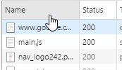 

   * La columna `Type` muestra el tipo de cada uno de los recursos.
      - `nav_logo242.png` es una imagen de tipo png.
        
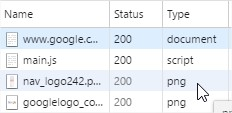 

   * La columna `Size`muestra el tamaño de los recursos.
      - El tamaño de `main.js` es 120KB
      
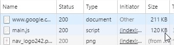 

   * La columna `Time` indica el tiempo que se demoro en cargar dicho recurso. 
      - En el caso `main.js` ha tardado 3ms.
        
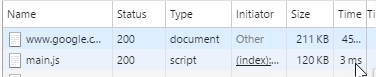 

   * En la barra inferior se puede observar:
      - 38 peticiones fueron realizadas para cargar la imagen.
      -  Se transfirio 478 KB.
      -  El proceso de carga culminó en 681 milisegundos.
      
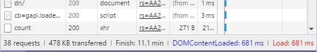 

  4. Al dar clic en la pestaña `Elements` se puede ver todos los elementos de la página HTML de Google. Tal como lo muestra la siguiente imagen.
    
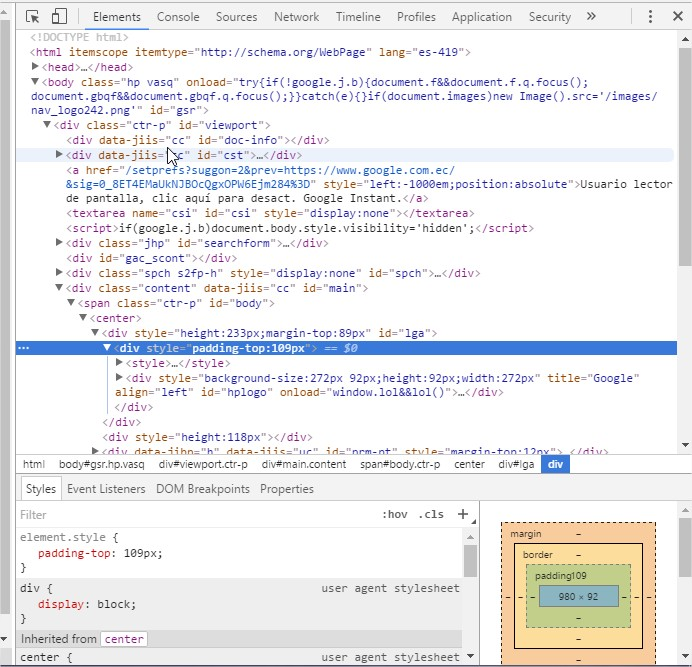 

  5. En la primera parte se muestra el código HTML de la página. Como se puede observar en la siguiente imagen.
    
  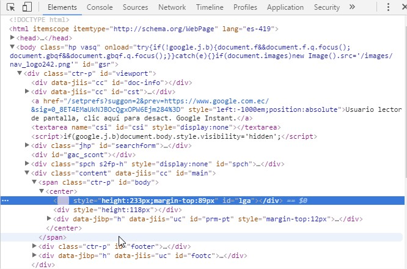 

  6. En la segunda parte se muestra los Estilos de la ágina, tal como se puede ver en la siguiente imagen.
  
  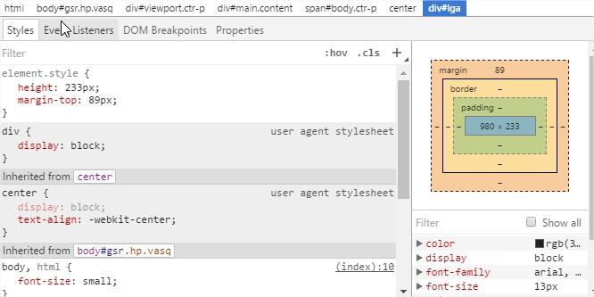 

   *  En la parte de estilos de una página HTML se puede modificar ciertos elementos, los cualses no se van a guadar. Esto se debe a que cada vez que se recarga la página, esta vulve a leer el archivo `.hmtl` que se encuentra almacenado en el servidor. 
      - Un ejemplo de lo que se puede cambiar en los estilos puede ser: cambio de color del fondo de la página de blanco a negro. Solo agragando la siguiente línea de comandos HTML `background-color: black;` en la parte de Styles tal como se ve en la siguiente imagen.
      
  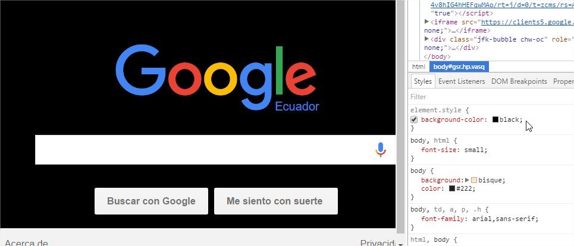 

  7. Para ver los Métodos que maneja HTTP se va a utilizar Postman. Para ello es necesario la descarga e instalacion de la extensión en Google Chrome, este es el navegador que esta siendo usado en esta práctica. La descarga se la puede realizar dando clik en <a href="https://chrome.google.com/webstore/detail/postman/fhbjgbiflinjbdggehcddcbncdddomop"> descarga postman </a>. 
  
  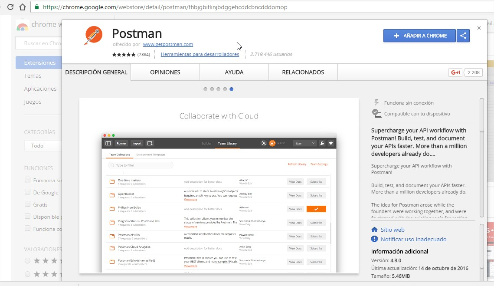 

  8. Una vez descargada e instalada Postman, la ventana principal se ve de la siguiente manera.
  
  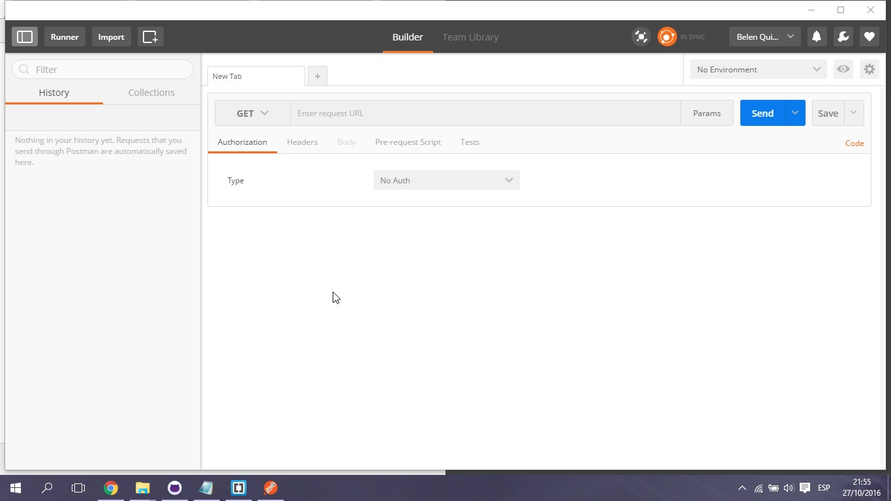 

  9. En esta aplicación se puede usar los diferente métodos que HTTP posee. Uno de los más usados es el `GET`. Para usarlo tenemos que ingresar alguna URL, en este caso será: `www.facebook.com` y después se hace clic en `send`. 
  
  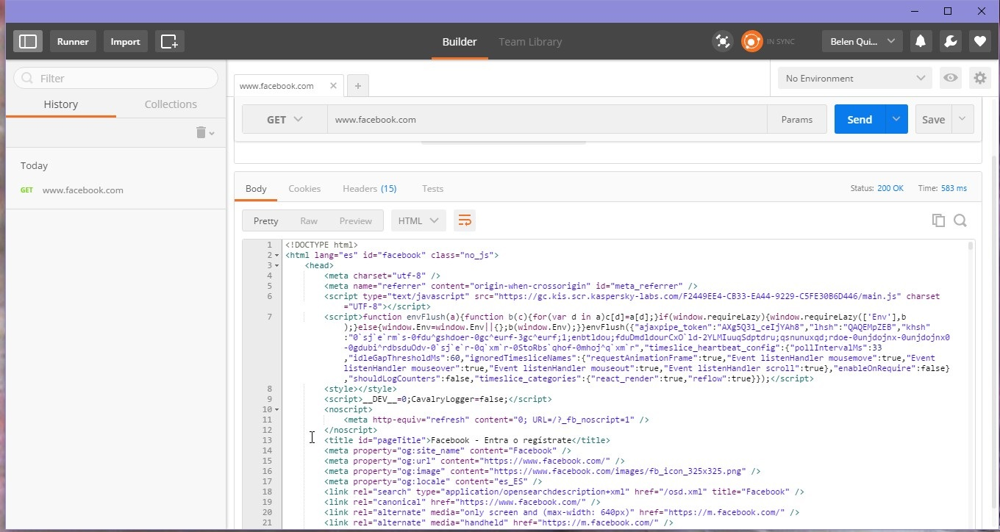 

 En la imagen anterior se puede ver:
 * La información que se observa en la sección `Body` corresponde al código HTML de la página.
 * También se puede ver en la parte superior que el Status Code devolvió `200 OK` y el tiempo que se demoró  fue de `583 ms`.
 
  10. Ahora en la pestaña `Headers`, se encuentran las 15 cabeceras, las cuales nos muestra cierta información, tal como:
   * `content-type` es una cabecera que muestra el tipo del documento, en este caso es un documento de texto HTML.
    * `date` muestra la hora y fecha actual 
    * `status` muestra el Status Code de HTTP.
    
  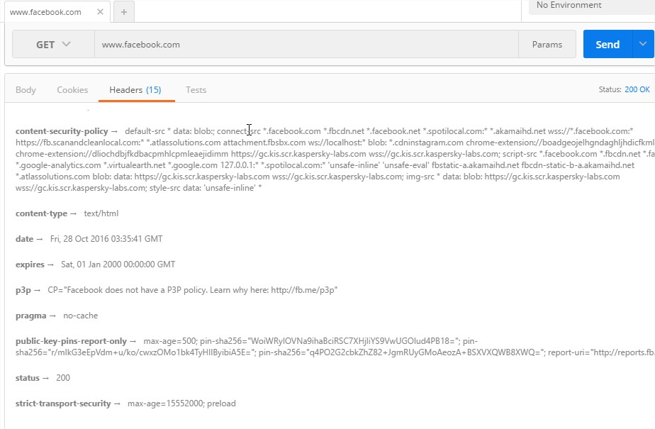 

  11. Si se cambia el método HTTP, no siempre se obtiene los mismos resultados. Por ejemplo si se cambia `GET` por `PATCH` nos muestra un código de error en el Status Code. Así como se ve en la siguiente imagen.
  
  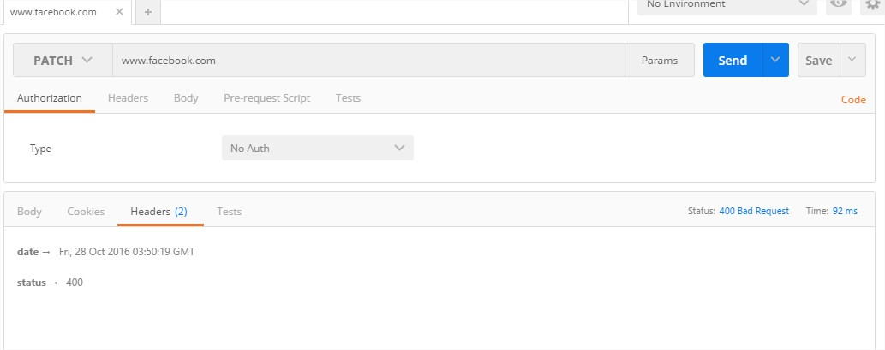 

  
  12. Una vez entendido que elemntos puede tener una página web en HTML se procede a crear una. Para esto se crea un archivo con extensión `.html` y su nombre es `index`.
  
  
  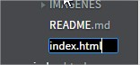 

  
  13. Ahora se procede a escribir el código de la página HTML. En este caso el código de la página se encuentra en <a href="https://github.com/belenquispi/Tec_Web_Js/blob/01-HTML/HTML/index.html">Código HTML</a>. Al crear este código se han empleado los tags explicados en en <a href="#tagHtml">Etiquetas de HTML</a>
  
  ### Detalles del códifo HTML
  ---
  `<html lang="en" style="background-color: #aba">`
   * `lang="en"` da entender que el lenguaje de la página es inglés.
   *  `style="background-color: #aba"`permive saber que el color de fonfo de la páguina es:#aba.
   
---
   
  `<meta charset="UTF-8">`
  - Da a entender que el código con el cual se esta codificando es UTF-8
  
---
   
  `<title>Aprendiendo HTML</title>`
 - Muestra que el título de la página es: `Aprendiendo HTML`
 
---

   `<body style="background-color: #fefefe;">`
   - Muestra que el color del body de la  página es: `#fefefe`
    
---

   `<h1>Caballeros del Zodiaco</h1>`
  * Es el título que tiene la fuente más de mayor tamaño.
  
---

` `
   * `` permite insertar imágenes a la página HTML.
   
   * Y en `src` se escribe la dirección web de la imagen. 
   * `alt` permite introducir u texto alternativo a la imagen. 
   
---
`
Saint Seiya (聖闘士星矢, Seinto Seiya?), conocido en español como Los Caballeros del Zodiaco, es un manga shōnen creado en 1986 por Masami Kurumada y publicado originalmente desde enero del mismo año en la revista Shūkan Shōnen Jump de la editorial Shūeisha hasta diciembre de 1990.
`

* Es el párrafo que se va a encontrar en la página HTML.
   
---
  `<ul>

    <li>Saint Seiya</li>

    <li>Aioria</li>

    <li>Shiryu</li>
</ul>`
* Genera la lista con los datos recibidos , pero esta lista es no ordena.

---
<ol>

    <li>Saint Seiya</li>

    <li>Aioria</li>

    <li>Shiryu</li>
</ol>
 * Genera una lista ordenada con los datos recibidos.

---
  14.  Levantamiento de un servidor HTTP en nuestra máquina, para ello se lleva a caso lo siguiente:  
   * Dirigimos a la carpeta donde está index.html, presionamos SHIFT y hacemos clic derecho para seleccionar Abrir ventana de comandos aquí.
   
   
  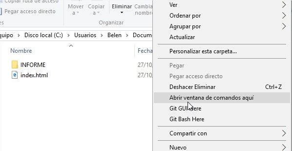 

   
   A continuación se escribe los siguiente comandos en la venta de comandos, con estos se levantará un servidor web. 
    
  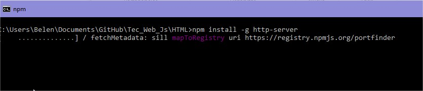 

     
  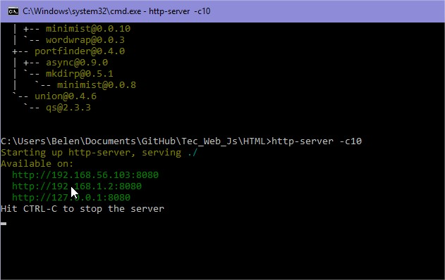 

  

## Conclusiones y Recomendaciónes 

Autor: <a href="https://github.com/belenquispi">Belén Quispi</a>

