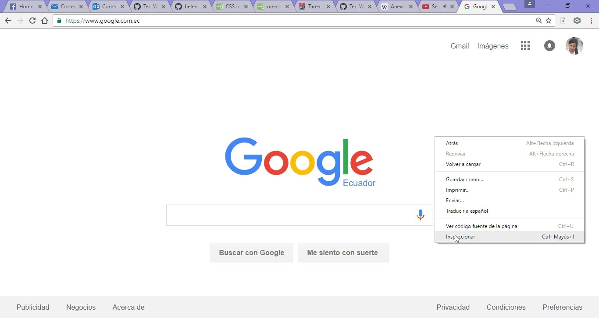

# Introducción a la Web
### Materia : `Tecnologías Web con JavaScript` 

### Tema : `Introducción a la Web`
### Fecha : `2016-10-28`
### Estudiante : `Belén Aracely Quispi Sotamba`
### Profesor : `Tania Calle - Adrian Eguez`
### Número de informe : `1`

## Índice de contenidos

- <a href="#tema">Tema</a>
- <a href="#objetivos">Objetivos</a>
- <a href="#marco-teorico">Marco Teorico</a>
    * <a href="#www">Definición de WWW</a>
    * <a href="#wwwwwwConsortium">World Wide Web Consortium</a>
    * <a href="#html">HTML</a>
        * <a href="#definicionHtml">Definición de HTML</a>
        * <a href="#estructuraHtml">Estructura de páginas de HTML</a>
        * <a href="#versionHtml">Versiones de HTML</a>
        * <a href="#tagHtml">Etiquetas de HTML</a>
    * <a href="#css">CSS</a>
        * <a href="#definicionCss">Definición de CSS</a>
    * <a href="#http">HTTP</a>
        * <a href="#definicionHttp">Definición de HTTP</a>
        * <a href="#metodosHttp">Métodos de HTTP</a>
        * <a href="#statusCodeHttp">Status Code HTTP</a>
        
- <a href="#desarrollo">Desarrollo de la Práctica</a>
- <a href="#conrec">Conclusiones y Recomendaciones</a>

## Tema
`Introducción a la Web`
 
<a href="#cabecera">Ir a la cabecera</a>
 

## Objetivos
- Desarrollar el conocimiento Web.
- Conocer herramientas de desarrollo web como: postman, inspector web.
- Aprender el uso de lenguaje HTML y CSS.
- Crear un página web.
 
<a href="#cabecera">Ir a la cabecera</a>
 

## Marco Teorico

### Definición de WWW

En informática, la World Wide Web (WWW) o red informática mundial es un sistema de distribución de documentos de hipertexto o hipermedios interconectados y accesibles vía Internet. Con un navegador web, un usuario visualiza sitios web compuestos de páginas web que pueden contener texto, imágenes, vídeos u otros contenidos multimedia, y navega a través de esas páginas usando hiperenlaces. (Fuente: [Wikipedia](https://es.wikipedia.org/wiki/World_Wide_Web))
 
<a href="#cabecera">Ir a la cabecera</a>
 

### World Wide Web Consortium

El World Wide Web Consortium (W3C) es una comunidad internacional que desarrolla estándares que aseguran el crecimiento de la Web a largo plazo. (Fuente: [W3C España](http://www.w3c.es/))
 
<a href="#cabecera">Ir a la cabecera</a>
 

## HTML

### Definición de HTML
HTML es el lenguaje de marcado estándar para la creación de páginas Web.

- HTML significa Hyper Text Markup Language.
- HTML describe la estructura de las páginas Web usando markup.
- Los elementos HTML son los bloques de construcción de páginas HTML.
- Los elementos HTML están representados por tags (etiquetas).
- Los navegadores no muestran las etiquetas HTML, pero los utilizan para representar el contenido de la página.
(Fuente: [W3School](http://www.w3schools.com/html/html_intro.asp))
 
<a href="#cabecera">Ir a la cabecera</a>
 

### Estructura de HTML

(Fuente: [Wikispaces](http://kermo.wikispaces.com/file/view/estructura%20html.png/485922800/625x426/estructura%20html.png))
 
<a href="#cabecera">Ir a la cabecera</a>
 

### Versiones de HTML

| Versión | Año |
|---|---|
|HTML|1991|
|HTML 2.0|1995|
|HTML 3.2|1967|
|HTML 4.01|1999|
|XHTML|2000|
|HTML5|2014|
(Fuente: [W3School](http://www.w3schools.com/html/html_intro.asp))
<a href="#cabecera">Ir a la cabecera</a>
 

### Etiquetas de HTML

Las etiquetas HTML son los nombres de elementos rodeados por paréntesis angulares.

* Etiquetas HTML normalmente vienen en pares como `
` y `
`.
* La primera etiqueta en un par es la etiqueta de inicio, la segunda etiqueta es la etiqueta de cierre.
* La etiqueta final se escribe igual a la etiqueta de inicio, pero con una barra inclinada insertada antes del nombre de la etiqueta.
* `La etiqueta de inicio también se llama la etiqueta de apertura y la etiqueta final de la etiqueta de cierre. `
 
    
| Tags| Definición |
| --- | --- |
|`<!DOCTYPE>` | Define el tipo de documento |
|`<html>` | Elemento raíz de una página HTML |
|`<head>` | Elemento que contiene o informacion de metadatos sobre el documento | 
|`<title>` | Elemento que especifica un título para el documento | 
| `<body>`| Elemento que contiene el contenido de la pñágina visible |
| `<h1>,<h2>,<h3>,<h4>,<h5>,<h6>` | Elementos que definen el tamaño del encabezado |
| `
` | Elemento que define un párrafo |
| `<a>` | Elemento que permite definir links |
| ``| Elemento que permite definir imágenes |
| ` `| Elemento vacío, sin etiqueta de apertura y define salto de línea |
(Fuente: [W3School](http://www.w3schools.com/html/html_intro.asp))
 
<a href="#cabecera">Ir a la cabecera</a>
 

## CSS

### Definición de CSS
* CSS es un lenguaje que describe el estilo de un documento HTML.

* CSS significa Cascading Style Sheets.
* CSS describe como los elementos HTML se van a mostrar en la pantalla, papel, o en otros medios.
* CSS ahorra mucho trabajo. 
* CSS puede controlar el diseño de varias páginas web a la vez.
(Fuente: [W3School](http://www.w3schools.com/css/css_intro.asp))
 
<a href="#cabecera">Ir a la cabecera</a>
 

## HTTP

### Definición de HTTP
* El Protocolo de transferencia de hipertexto (HTTP) está diseñado para permitir las comunicaciones entre clientes y servidores.

* HTTP funciona como un protocolo de petición-respuesta entre un cliente y el servidor.

* Un navegador web puede ser el cliente y una aplicación en un equipo que aloja un sitio web puede ser el servidor.

    - `Ejemplo`: Un cliente (navegador) envía una solicitud HTTP al servidor; a continuación, el servidor devuelve una respuesta al cliente. La respuesta contiene información del estado de la solicitud y también puede contener el contenido solicitado.
 
(Fuente: [W3School](http://www.w3schools.com/tags/ref_httpmethods.asp))
 
<a href="#cabecera">Ir a la cabecera</a>
 

### Métodos HTTP

|Método|Descripción|
|---|---|
|GET|Solicita datos de un recurso especificado|
|POSTAL| Envia datos a ser procesados en un recurso especificado|
|HEAD|Igual que GET para retorna solo encabezados HTTP y no el cuerpo del documento|
|PUT|Carga una representación a una URI especificada|
|DELETE|Elimina el recurso especificado|
|OPTIONS|Retorna los métodos HTTP que el servidor soporta|
|CONNECT|Convierta la conexión de petición a un túnel TCP/IP transparente|
(Fuente: [W3School](http://www.w3schools.com/tags/ref_httpmethods.asp))
 
<a href="#cabecera">Ir a la cabecera</a>
 

### Status Code HTTP
Cuando un navegador solicita un servicio de un servidor web, se puede producir un error.

A continuación se proporciona una lista de los números con los cuales empiensan los códigos de mensajes de estado HTTP que podrían ser devueltos:

|Código|Significado|
|---|---|
|1xx|Información|
|2xx|Exitosa|
|3xx|Redirección|
|4xx|Error de cliente|
|5xx|Error del servidor|

(Fuente: [W3School](http://www.w3schools.com/tags/ref_httpmessages.asp))
 
<a href="#cabecera">Ir a la cabecera</a>
 

## Desarrollo de la Práctica
  1. Se abre el navegador de Google Chrome y se dirige a la URL <a href="www.google.com.ec">www.google.com.ec</a>. Tal como se puede ver en la siguiente imagen. 
  

   

  2. Despúes se da clic derecho y se selecciona la opción `Inspeccionar`. Tal como lo muestra la siguiente imagen.
  

   

  
  3. Se procede a seleccionar la pestaña `Network` y se puede observar la variedad de información que se carga al momento de abrir una página HTML.
  

   

  
  En la imagen anterior se puede observar una tabla que contiene información importante como:
  * La columna `Name` es  donde se encuentran el nombre de todos los recursos que se deben cargarse para mostrar la página HTML de Google.
    - Por ejemplo `nav_logo242.png` es una imagen genérica de google. 
    

    

    
  * La columna `Status` indica el Status Code HTTP de cada recurso que se cargo.
    - El recurso `nav_logo242.png` devolvió el código 200, lo cual indica que fue exitoso.
  * La columna `Type` muestra el tipo de cada uno de los recursos.
    - `nav_logo242.png` es una imagen de tipo png.
  * La columna `Size`muestra el tamaño de los recursos.
    - El tamaño de `main.js` es 120KB
  * La columna `Time` indica el tiempo que se demoro en cargar dicho recurso. 
    - En el caso `main.js` ha tardado 3ms.
  * En la barra inferior se puede observar:
    - 22 peticiones fueron realizadas para cargar la imagen.
    -  Se transfirio 79.5 KB.
    - El proceso de carga culminó en 6.54 segundos.
    
  4. 
  5.
  

## Conclusiones y Recomendaciónes 

Autor: <a href="https://github.com/belenquispi">Belén Quispi</a>

