# Sailsjs - Assets - Views - Controllers -  Pipeline

### Materia: `Tecnologías Web con JavaScript`
### Tema: `Sailsjs - Assets - Views - Controllers -  Pipeline`
### Fecha: `2017-01-05`
### Estudiante: Belén Aracely Quispi Sotamba
### Profesor: Tania Calle - Adrian Eguez
### Número de informe: 5

<a name="Cabecera"></a>
## Índice de contenidos

* <a href="#tema">Tema</a>
* <a href="#objetivos">Objetivos</a>
* <a href="#marcoTeorico">Marco Teórico</a>
    - <a href="#sails">Sails.js</a>
    - <a href="#assets">Assets</a>
    - <a href="#views">Views</a>
    - <a href="#routes">Routes</a>
    - <a href="#controllers">Controllers</a>
    - <a href="#pipeline">Pipeline</a>
    
* <a href="#desarrollo">Desarrollo de la Práctica</a>
* <a href="#conrec">Conclusiones y Recomendaciones</a>

<a name="tema"></a>
## Tema
`Sailsjs - Assets - Views - Controllers -  Pipeline`
<br>
<a href="#Cabecera">Ir a la cabecera</a>
<br>

<a name="objetivos"></a>
## Objetivos
*   Entender el uso de sails para el desarrollo web.
*   Aprender a usar los assets de sails para la ímplementación de una páquina web.
*   Crear mediante el uso de views.
*   Aprender a crear routes y controllers en el desarrollo web.
*   Entender el funcionamiento de las rutas y los controladores en el desarrollo web.

<br>
<a href="#Cabecera">Ir a la cabecera</a>
<br>

<a name="marcoTeorico"></a>
## Marco Teórico
<a name="sails"></a>
### Sails.js
<p align="center"> </p>
*   **Sails.js** es un framework o un Marco de Trabajo hecho en JavaScript en Nodejs. 
*   Sails facilita la creación de aplicaciones personalizadas Node.js de calidad empresarial. 
*   Está diseñado para emular el patrón MVC familiar de marcos como Ruby on Rails, pero con soporte para los requisitos de las aplicaciones modernas: API orientadas a datos con una arquitectura escalable y orientada al servicio. 
*   Es especialmente bueno para la construcción de chat, paneles de control en tiempo real, o juegos multijugador; Pero se puede utilizar para cualquier proyecto de aplicación web - de arriba a abajo.

<br>
(Fuente: [Sails.js](http://sailsjs.com/))
<br>
<a href="#Cabecera">Ir a la cabecera</a>
<br>

<a name="assets"></a>
### Assets
<p align="center"> </p>
*   Los assets son una carpeta dentro del Framework la cual funciona como un servidor web de archivos estáticos, en donde cualquier tipo de archivos que se coloque en esta carpeta será mostrada al público.
*   Los assets se refieren a archivos estáticos (js, css, imágenes, etc) en su servidor desea hacer accesible al mundo exterior. 
*   En Sails, estos archivos se colocan en la carpeta **assets/**. 
*   Cuando levante su aplicación, agregue archivos a sus activos o carpeta, o cambie los activos existentes, los procesos de canalización de activos integrados de Sails y sincroniza esos archivos en una carpeta oculta **(.tmp / public /)**.

<br>
(Fuente: [Assets](http://sailsjs.com/documentation/concepts/assets))
<br>
<a href="#Cabecera">Ir a la cabecera</a>
<br>

<a name="views"></a>
### Views
<p align="center"> </p>
*   Las vistas son las páginas que se va a mostrar al usuario dependiendo de la lógica que tenga nuestra aplicación de sailsjs. 
*   En sails, las vistas son plantillas de marcado que se compilan en el servidor en páginas HTML. 
*   En la mayoría de los casos, las vistas se utilizan como respuesta a una solicitud HTTP entrante para servir su página de inicio.
*   Una vista puede ser compilada directamente en una cadena HTML para su uso en el código del backend. Por ejemplo, puede usar este enfoque para enviar correos electrónicos HTML o para construir grandes cadenas XML para usar con un API heredada.

<br>
(Fuente: [Views](http://sailsjs.com/documentation/concepts/views))
<br>
<a href="#Cabecera">Ir a la cabecera</a>
<br>
    
<a name="routes"></a>
### Routes
<p align="center"> </p>
*   Las rutas son a donde vamos a direccionar nuestro trafico dependiendo los métodos HTTP y el URL de nuestros recursos.
*   La característica más básica de cualquier aplicación web es la capacidad de interpretar una solicitud enviada a una URL y, a continuación, enviar una respuesta. Para ello, su aplicación debe ser capaz de distinguir una URL de otra.
*   La mayoría de los frameworks web, Sails proporciona un enrutador: un mecanismo para asignar URL a controladores y vistas. 
*   Las rutas son reglas que le dicen a Sails qué hacer cuando se enfrentan a una petición entrante. Existen dos tipos principales de rutas en Sails: **personalizadas** (o "explícitas") y **automáticas** (o "implícitas").

<br>
(Fuente: [Routes](http://sailsjs.com/documentation/concepts/routes))
<br>
<a href="#Cabecera">Ir a la cabecera</a>
<br>

<a name="controllers"></a>
### Controllers
<p align="center">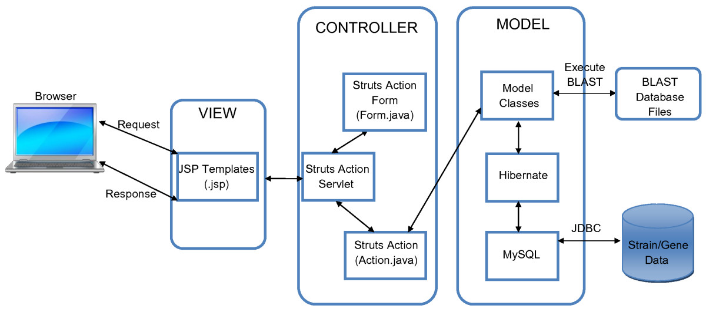 </p>
*   Los controladores dentro de Sailsjs tienen como finalidad brindar los métodos CRUD de nuestros modelos, así también como exponer la lógica de negocio que se defina en la aplicación, como por ejemplo la autenticación.
*   Los controladores (la C en MVC) son los principales objetos de su aplicación Sails que son responsables de responder a las solicitudes de un navegador web, una aplicación móvil o cualquier otro sistema capaz de comunicarse con un servidor. 
*   Actúan como intermediarios entre los modelos y puntos de vista. 
*   Los controladores contendrán la mayor parte de la lógica de negocio de su proyecto.
<br>
(Fuente: [Controllers](http://sailsjs.com/documentation/concepts/controllers))
<br>
<a href="#Cabecera">Ir a la cabecera</a>
<br>

<a name="pipeline"></a>
### Pipeline
<p align="center"> </p>
*   En el archivo pipeline.js dentro de la carpeta task se encuentran las diferentes configuraciones de GRUNT que es un automatizador de actividades con JavaScript. 
*   Dentro de este archivo se puede configurar los assets que van a ser inyectados en todas las vistas de nuestra aplicación en Sailsjs. 
*   El directorio tasks / contiene un conjunto de tareas Grunt y sus configuraciones.
*   Las tareas son útiles principalmente para agrupar activos de front-end (como hojas de estilo, scripts y plantillas de marcado del lado del cliente), pero también pueden usarse para automatizar todo tipo de tareas de desarrollo repetitivo, desde compilación de explorador hasta migraciones de bases de datos.
*   Sails agrupa algunas tareas predeterminadas por conveniencia, pero con literalmente cientos de complementos para elegir, puede utilizar tareas para automatizar casi cualquier cosa con un mínimo esfuerzo. Si alguien no ha construido lo que necesita, siempre puede crear y publicar su propio plugin Grunt a npm!
<br>
(Fuente: [Task Automation](http://sailsjs.com/documentation/concepts/assets/task-automation)
<br>
<a href="#Cabecera">Ir a la cabecera</a>
<br>

<a name="desarrollo"></a>
## Desarrollo de la Práctica

1)  Instalar *Sails.js*. Para lo cual se abre una consola de comandos, luego se ejecuta el siguiente comando:
> npm install -g sails 

<p align="center">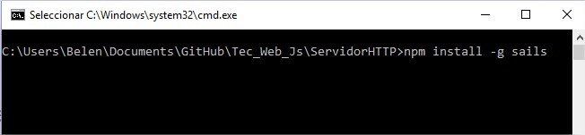 </p>

2)  Ahora se procede a crear un proyecto con Sails, para lo cual hay que movilizarse al directorio en el cual se va  a crear el proyecto. En este caso se va ha crear en el directorio ServidorHTTP2. 

3)  Para la crear el proyecto se lo hace mediante el siguiente comando:
> sails new nombreProyecto

En este caso el proyecto se va a llamar Proyecto1.
<p align="center">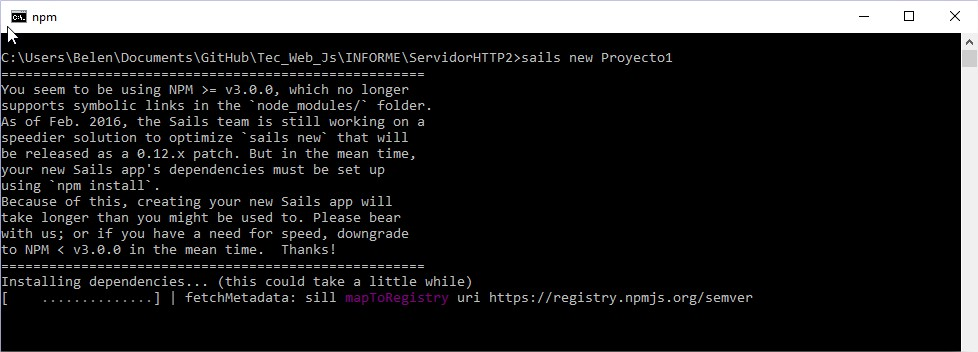 </p>
<p align="center">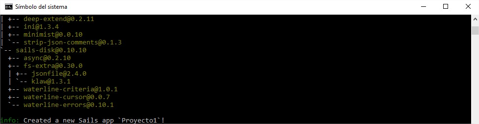 </p>

4)  A continuación, se puede observar que se ha creado una carpeta denominada Proyecto1, la cual se creó en el directorio seleccionado. 

<p align="center">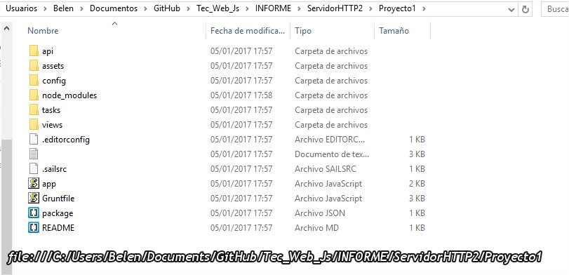 </p>

5)  Ahora se levanta el servidor, para lo cual se cambia a la carpeta *Proyecto1*, y se ejecuta el siguiente comando para levantar el servidor:
> sails lift

<p align="center">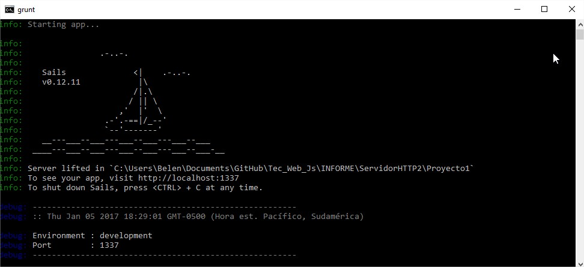 </p>

6)  Para verificar que el servidor se ha levantado se accede a la siguiente URL 
``` localhost:1337 ``` 

<p align="center">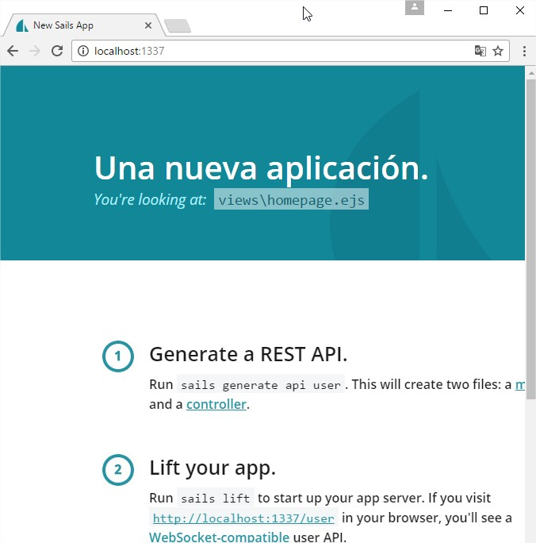 </p>

7)En la carpeta *assets* se crea otra carpeta denomina *App*, la cual va a tener los tres siguientes archivos:
*   index.html
*   estilos.css
*   app.js

<p align="center">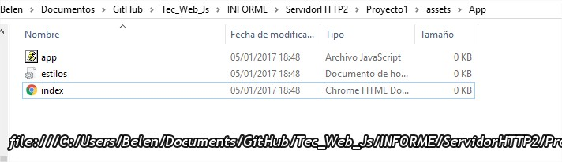 </p>

8) Modificar el archivo index.html, con el siguiente código, en el cual se realiza un enlace a los archivos estilos.css y app.js:
```html
<!DOCTYPE html>
<html lang="en">
<head>
    <meta charset="UTF-8">
    <title>Document</title>
    <link rel="stylesheet" href="estilos.css">
</head>
<body>
   <h1>¡¡¡Ya estoy aquí!!!</h1>
   <script src="app.js"></script>
    
</body>
</html>

```

9) Modificar el archivo estilos.css, el cual va a permitir que la página html tenga de fondo un color violeta y las letras de color blanco.
```css
body{
    background-color: blueviolet;
    color: white;
}

```

10) Modificar el archivo app.js, el cual va a enviar un mensaje de alerta al momento de abrir la página. 
```javascript
alert("No es bueno usar alertas");

```

11) Para verificar que los archivos css y js realizan su efecto en la página html que se ha sido escrito en el archivo index.html se debe ingresar a la siguiente URL ```http://localhost:1337/App/index.html``` y aparecerá una página como la siguiente:

<p align="center">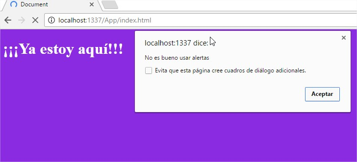 </p>

12) Crear una carpeta denominada *fotos* en la carpeta *App*, en la cual se va ha almacenar las fotos a ser usadas en la página. 

<p align="center">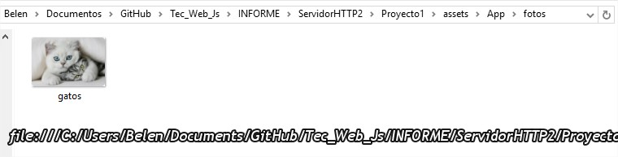 </p>

13) Se puede acceder a la carpeta *fotos* y a los archivos de esta. Esto se puede realizar accediendo a partir de la URL  de la siguiente forma ``` http://localhost:1337/App/fotos/gatos.jpg ```

<p align="center"> </p>

*   También se puede agregar la imagen a la página *HTML*, para ello se usa el tag ``````. Entonces la imagen aparecerá en la página de la siguiente URL: ``` http://localhost:1337/App/index.html ``` 

<p align="center">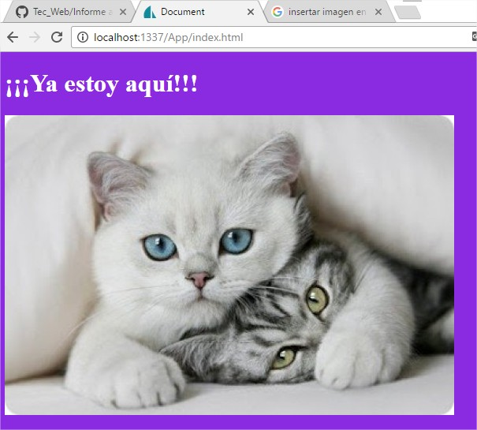 </p>

14) En la carpeta *tasks* se encuentra un archivo denominado *pipeline.js*, en el cual se encuentran la referencia de los archivos *css* que son inyectados en el proyecto que se ha creado. 
```
// CSS files to inject in order
//
// (if you're using LESS with the built-in default config, you'll want
//  to change `assets/styles/importer.less` instead.)
var cssFilesToInject = [
  'styles/**/*.css'
];
```

15) Si se desea que un archivo *css* sea inyectado en el proyecto este debe estar en la carpeta *style* de la carpeta *assets*. Crear un archivo denominado *estilos.css*, en este se va a definir ciertos estilos para el proyecto.

<p align="center">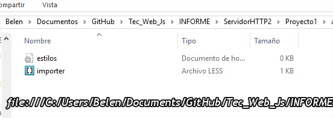 </p>

*   En el archivo *estilos.css* se definen ciertos estilos, tal como se muestra en el siguiente código
```css
body {
    background-color: fuchsia;
    color: green;
}
```

16) Si se referencia el archivo *css* que se creo anteriormente en el archivo *pipeline.js*, este cambiará los estilos de la página de inicio del proyecto, tal como se muestra en la siguiente imagen.

<p align="center">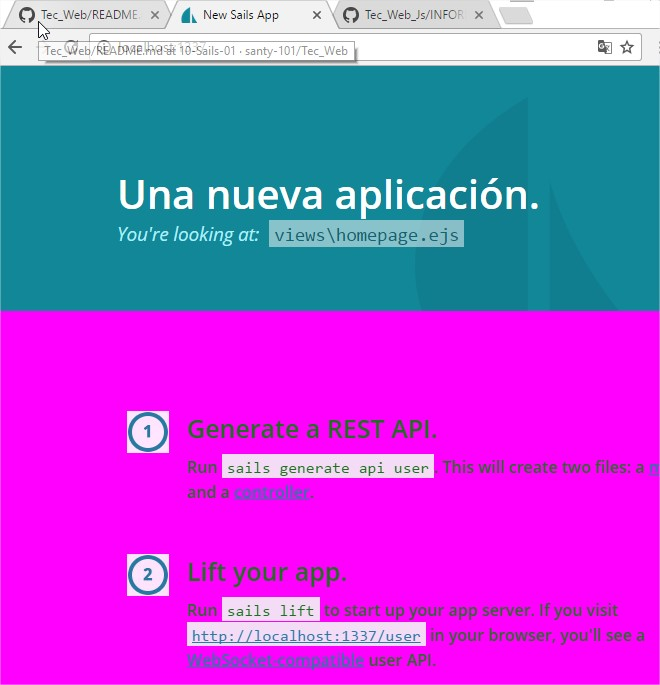 </p>

*   Para que la página anterior se pueda ver de esa nueva manera, el archivo *pipeline.js* tendría el siguiente código:
```// CSS files to inject in order
//
// (if you're using LESS with the built-in default config, you'll want
//  to change `assets/styles/importer.less` instead.)
var cssFilesToInject = [
  //'styles/**/*.css'
    'styles/estilos.css'
];
```

17) Manejar las vistas, las cuales se encuentran en la carpeta *views* y cada archivo cuenta con un formato *.ejs*, tal como se puede ver en la siguiente imagen.

<p align="center">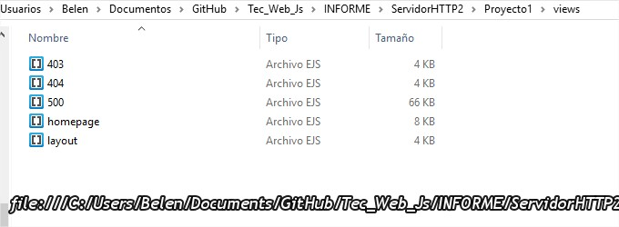 </p>

18) En la vista denominada *homepage* se encuentra toda la información que es visualizada en la página de inicio del proyecto. Para ello se se procede a cambiar su contenido ingresando el siguiente código en la vista *homepage*.
```
<style>
    .rojo{

        background-color:red;
        color: white;

    }
</style>
<div class ="rojo">

<h1>Aquí empieza el homepage</h1>


<h1>!!!Hola a todos¡¡¡</h1>


<h1>Aquí finaliza el homepage</h1>
</div>
```
*   Al actualizar la página web se tendría de la siguiente manera.

<p align="center">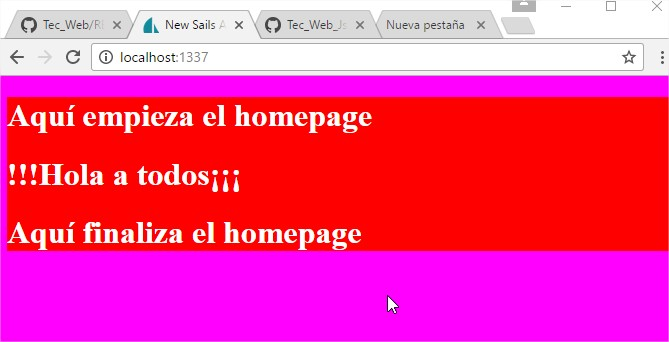 </p>

19) En cambio las demás vistas como: *403* , *404* y *500* son mostradas al usuario en el navegador si se presento algún tipo de error. 

*   Un ejemplo podría ser querer ingresar a un archivo que no se encuentra disponible, por lo cual nos saldría la siguiente view.

<p align="center">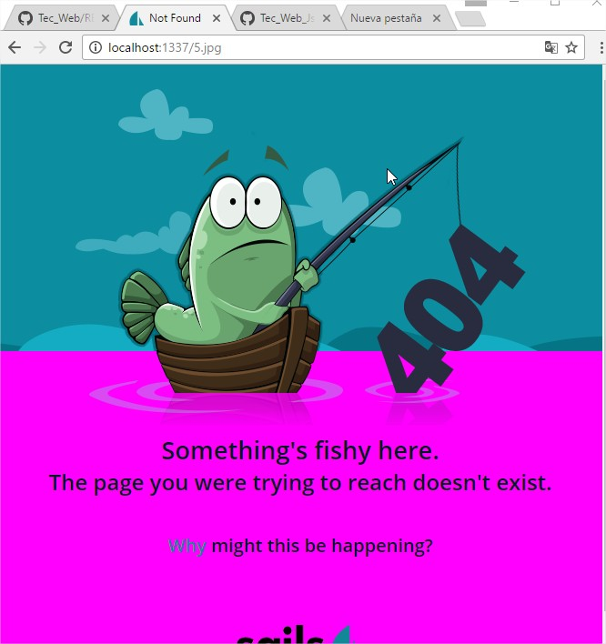 </p>

20) Crear vistas, las cuales mántendran la información en este caso una de Quito y la otra de Guayaquil. Para ello se crean dos archivos dentro de la carpeta *views*, con el nombre de *Quito* y *Guayaquil*.

<p align="center">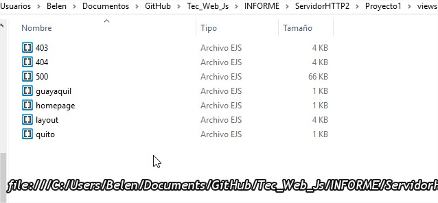 </p>

21) Para de mostración del uso de las vistas, se ingresará un código muy simple en cada una de las vistas creadas.
*   **Quito**
```html
<h1>Quito</h1>
```

*   **Guayaquil**
```html
<h1>Guayaquil</h1>
```

22) Para acceder a las *views* es necesario configurar el archivo *routes.js*, el cual se encuentra en la carpeta *config*.

<p align="center">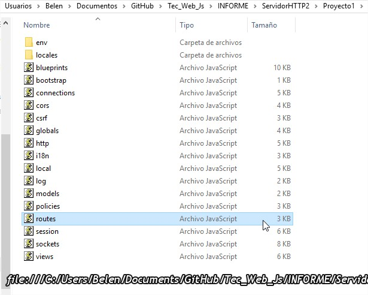 </p>

23) El archivo *roues.js* debe se modificado para que se vea de la siguiente manera. Donde ya se hace referencia a las dos vistas que fueron creadas ultimamente. 

```
module.exports.routes = {

  /***************************************************************************
  *                                                                          *
  * Make the view located at `views/homepage.ejs` (or `views/homepage.jade`, *
  * etc. depending on your default view engine) your home page.              *
  *                                                                          *
  * (Alternatively, remove this and add an `index.html` file in your         *
  * `assets` directory)                                                      *
  *                                                                          *
  ***************************************************************************/

  '/': {
    view: 'homepage'
  },
    '/Quito': {
    view:'quito'
  },
     '/Guayaquil': {
    view:'guayaquil'
  }
```

24) Como se ha modificados archivos de configuración del servidor es necesario que se reinicie el sails. Luego ya se podrá acceder a las nuevas vistas que se han creado. Los URLs a ser usados serían los siguientes: ```http://localhost:1337/Quito``` y ```http://localhost:1337/Guayaquil```
*   **Quito**
<p align="center">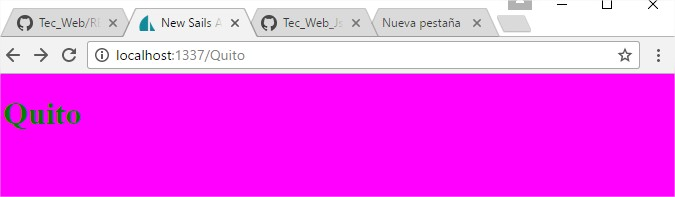 </p>

*   **Guayaquil**
<p align="center">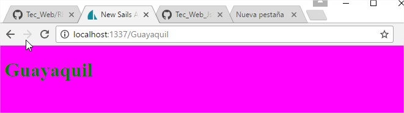 </p>

25) Modificar la vista *layout.ejs* , el cual cambiará la manera en como se muestra la vista *homepage*. Para lo que se cambia el códgo que posee por el siguiente.
```
 <!--STYLES-->
    <link rel="stylesheet" href="/styles/estilos.css">
    <!--STYLES END-->
  </head>


  <body>
  <h1>Hola</h1>
  <ul>
      <li><a href="/Quito">Quito</a>
      </li>
      <li>
          <a href="/Guayaquil">Guayaquil</a>
      </li>

  </ul>
  <%- body %>
      <h1>Adiós</h1>
```

*   Los cambios realizados se visualizan de la sigueinte manera:

<p align="center">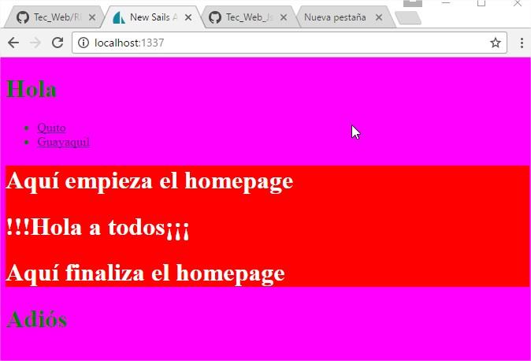 </p>

26) Ahora se crea un controlador, para lo cual se usa el siguiente comando.
> sails generate controller nombreControlador.

En este caso el controlador se llamará *Saludo*.

<p align="center">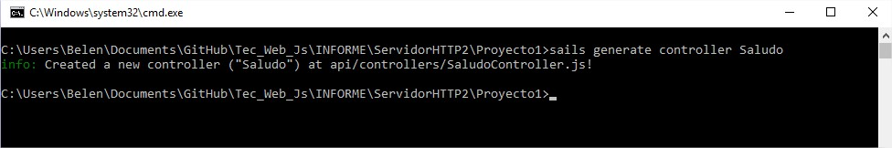 </p>

27) Para verificar que se ha creado el controlador, se procede a verificar que se haya creado un archivo del controlador con el nombre del controlador dentro de la carpeta */api/controllers*. Tal como se muestra en la siguiente imagen.

<p align="center">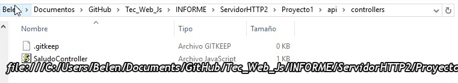 </p>

28) Modificar el archivo *SaludoController*, en el cual se ingresa el siguiente código, el cual permite manejar las peticiones que se realizan hacia el servidor web.

```
module.exports = {

    hola: function (req, res) {
        var parametros = req.allParams();

        if (req.method == 'GET') {

            res.json({
                    nombre: 'Hola get',
                    para:parametros
                });


        } else {

            if (req.method == 'POST') {
                res.json({
                    nombre: 'Hola post'
                });
            } else {
                res.json({
                    nombre: 'Hola a todos'
                });
            }

        }

    },
    adios: function (req, res) {
        res.send('Adios');
    },
    queTal: function (req, res) {
        res.send('Quetal');
    }


};
```
29) Para verificar que los controladores funcionen correctamente se los verifica usando el navegador y con la opción GET.
* Si se usa la URL ```http://localhost:1337/Saludo/queTal```el servidor nos responde de la siguiente manera.

<p align="center">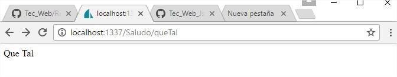 </p>

* Similar si se usa la URL ```http://localhost:1337/Saludo/adios```.

<p align="center"> </p>

* En cambio si se usa la URL ```http://localhost:1337/Saludo/hola```el servidor nos responde usando un objeto json.

<p align="center">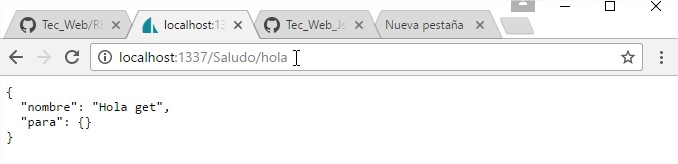 </p>

30) Para verificar el comportamiento con la petición POST, se lo realiza usando Postman.

<p align="center">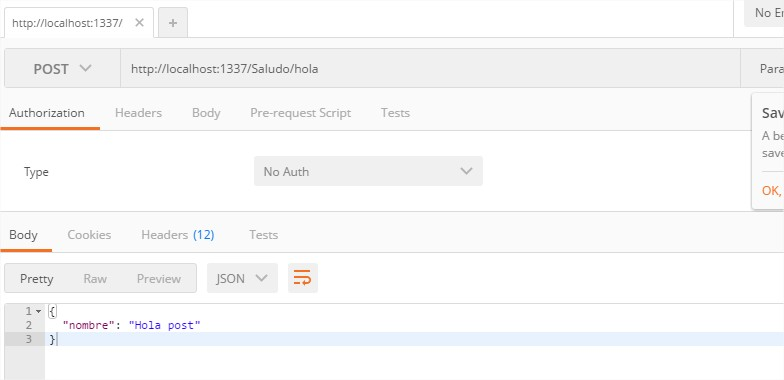 </p>

<br>
<a href="#Cabecera">Ir a la cabecera</a>
<br>

<a name="conrec"></a>
## Conclusiones y Recomendaciones
*   Sails.js permite crear servidores web, usando el gestor de paquetes npm.
*   La carpeta assets mantiene todos los archivos que van a poder ser vistos por los usuarios en los navegadores.
*   Se puede crear vistas tanto como se crean necesarias, y se las pueden vincular como se vio en la presente práctica.
*   Los controladores permiten manejar los tipos de peticiones que se las realizan el servidor y como este responde.
*   Se recomienda revisar el correcto uso de los comando a ser ejecutados y en que directorios se los ejecuta para obtener los resultados deseados.


<br>
<a href="#Cabecera">Ir a la cabecera</a>
<br>
___ 

Autor: <a href="https://github.com/belenquispi">Belén Quispi</a>
<br>
<a href="#Cabecera">Ir a la cabecera</a>
<br>