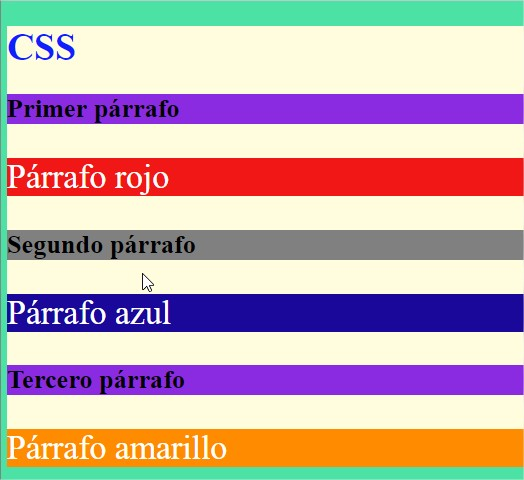
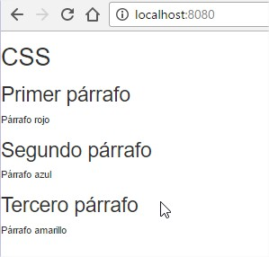
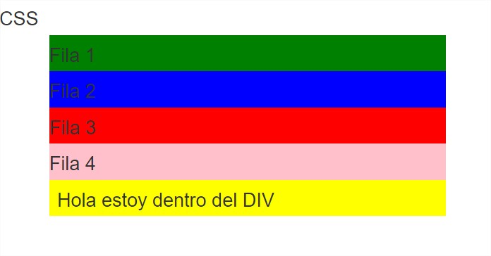
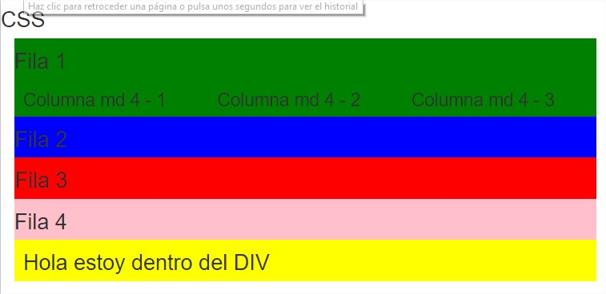
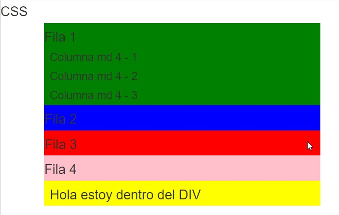
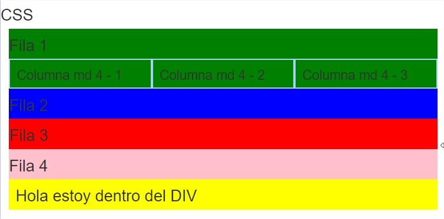
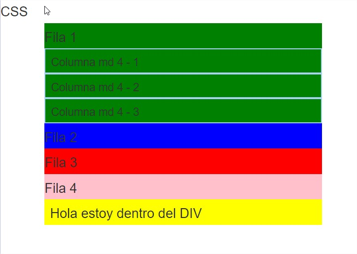
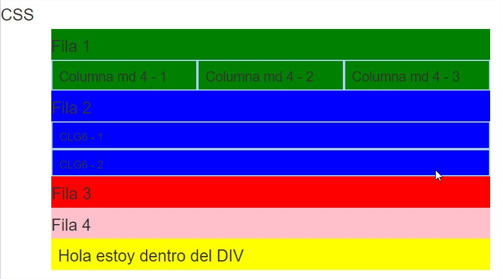
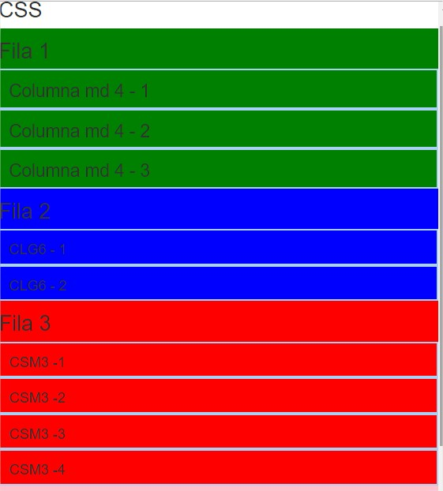
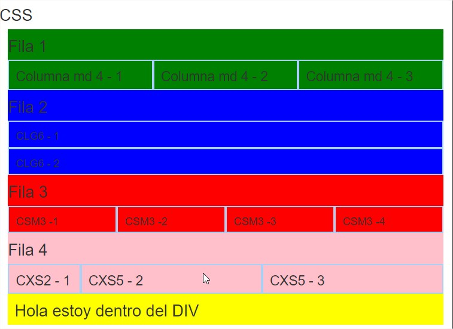

# CSS

### Materia: `Tecnologías Web con JavaScript`
### Tema: `CSS`
### Fecha: `2016-11-02`
### Estudiante: Belén Aracely Quispi Sotamba
### Profesor: Tania Calle - Adrian Eguez
### Número de informe: 2

<a name="Cabecera"></a>
## Índice de contenidos

* <a href="#tema">Tema</a>
* <a href="#objetivos">Objetivos</a>
* <a href="#marcoTeorico">Marco Teórico</a>
    - <a href="#css">CSS</a>
        - <a href="#sintexisCss">Sintaxis CSS</a>
        - <a href="#formasInsertarCss">Formas de Insertar CSS</a>
            - <a href="#hojaEstilosExterna"> Hojas de Estilos Externa</a>
            - <a href="#hojaEstiloInterna">Hojas de Estilos Interna</a>
            - <a href="#estiloLinea">Estilos en Linea</a>
    - <a href="#bootstrap">Bootstrap</a>
* <a href="#desarrollo">Desarrollo de la Práctica</a>
* <a href="#conrec">Conclusiones y Recomendaciones</a>

<a name="tema"></a>
## Tema
`CSS`
<br>
<a href="#Cabecera">Ir a la cabecera</a>
<br>


<a name="objetivos"></a>
## Objetivos
* Desarrollar el conocimiento WEB
* Implementar recursos CSS obtenidos del framework Bootstrap.
* Aprender el uso de recursos CSS en la creación de páginas HTML.
* Entender los beneficios de usar CSS.
<br>
<a href="#Cabecera">Ir a la cabecera</a>
<br>


<a name="marcoTeorico"></a>
## Marco Teórico
<a name="css"></a>
### CSS
* CSS significa C ascading S tyle S heets.
* CSS es un lenguaje que describe el estilo de un documento HTML.
* CSS describe cómo los elementos HTML se van a mostrar en la pantalla, papel, o en otros medios. 
* CSS describe cómo se deben mostrar los elementos HTML.
* CSS ahorra mucho trabajo, debido a que puede controlar el diseño de varias páginas web a la vez.
* CSS define incluso la disposicion y las variaciones en la imagen para los diferentes dispositvos y tamaños de pantalla.
* CSS  fue creado por W3C para eliminar el estilo de formato de la página HTML.
<br>
(Fuente: [W3School](http://www.w3schools.com/css/css_intro.asp))
<br>
<a href="#cCabecera">Ir a la cabecera</a>
<br>


<a name="sintexisCss"></a>
#### Sintáxis de CSS
Un conjunto de reglas CSS consta de un selector y un bloque de declaración.

```html 

    h1 {color: blue; font-size:12px;}
    
```

* `h1` es el selector, es decir a que elemento HTML se le va dar ese estilo.
`{color: blue; font-size:12px;}` es el bloque de declaración, el cuál consta de una o varias declaraciones. 
* Cada declaración es una propiedad CSS y un valor, los cuales son separados por dos puntos.
* Cada declaración debe terminar con punto y coma.
<br>
(Fuente: [W3School](http://www.w3schools.com/css/css_syntax.asp))
<br>
<a href="#Cabecera">Ir a la cabecera</a>
<br>


<a name="formasInsertarCss"></a>
#### Formas de insertar CSS
Hay tres maneras de insertar una hoja de estilo:
* Hoja de estilos externa
* Hoja de estilo interna
* Estilo en línea
<br>
(Fuente: [W3School](http://www.w3schools.com/css/css_howto.asp))
<br>
<a href="#Cabecera">Ir a la cabecera</a>
<br>


<a name="hojaEstilosExterna"></a>
#### Hoja de Estilos Externa
* Hoja de estilos externa, puede cambiar el aspecto de un sitio web completo cambiando un archivo. 
* Cada página debe incluir una referencia al archivo de hoja de estilos externa dentro del elemento `<link>`. El elemento `<link>` va dentro de la sección `<head>`.
* Una hoja de estilo externa puede estar escrito en cualquier editor de texto. El archivo no debe contener ninguna etiqueta HTML. 
* El archivo de hoja de estilo debe ser guardado con una extensión .css

##### Ejemplo
``` html 
<head>
    <link rel="stylesheet" type="text/css" href="mystyle.css">
</head>
```
<br>
(Fuente: [W3School](http://www.w3schools.com/css/css_howto.asp))
<br>
<a href="#Cabecera">Ir a la cabecera</a>
<br>


<a name="hojaEstiloInterna"></a>
#### Hoja de Estilos Interna
* Una hoja de estilo interna puede ser usado si una sola página tiene un estilo único.
* Los estilos internos se definen dentro del elemento `<style>`, dentro de la sección `<head>` de una página HTML.

##### Ejemplo
``` html 
    <head> 
        <style> 
            body { 
            background-color: linen; 
            } 
            h1 
            {     
            color: maroon;    
            margin-left: 40px; 
            } 
        </style> 
    </head>
```
<br>
(Fuente: [W3School](http://www.w3schools.com/css/css_howto.asp))
<br>
<a href="#Cabecera">Ir a la cabecera</a>
<br>


<a name="estiloLinea"></a>
#### Estilo en línea
* Un estilo en línea se puede utilizar para aplicar un estilo único para un solo elemento.
* Para utilizar los estilos en línea, añadir el atributo de estilo al elemento relevante. El atributo de estilo puede contener cualquier propiedad CSS.
* El siguiente ejemplo muestra cómo cambiar el color y el margen izquierdo de un elemento `<h1>`

##### Ejemplo
 ```html
    <h1 style="color:blue;margin-left:30px;">This is a heading.</h1>
```
 
##### Nota: 
Cuando se tiene varios estilos para un mismo elemento, estos se aplican en cascada, es decir, se aplicará el primero que se encuentre, luego el segundo hasta el último estilo que fue implementado.
<br>
(Fuente: [W3School](http://www.w3schools.com/css/css_howto.asp))
<br>
<a href="#Cabecera">Ir a la cabecera</a>
<br>


<a name="bootstrap"></a>
### BOOTSTRAP
* Bootstrap es el framework HTML, CSS y JS más popular para desarrollar proyectos móbiles responsivos en la web.
* Gracias a Bootstrap es posible escalar sitios web y aplicaciones de: teléfonos a tabletas y a computadores de escritorio es más fácil y eficiente.
(Fuente: [Bootstrap](http://getbootstrap.com))
<br>
<a href="#Cabecera">Ir a la cabecera</a>
<br>

<a name="desarrollo"></a>
## Desarrollo de la Práctica
En esta práctica se creará un archivo HTML, el cual va a ser modificado. En este caso el archivo se llama *index.html*.

1) En el archivo *index.html* se escribe un documento html básico. 
  
```html
    
    <!doctype html>
    <html lang="en">
    <head>
    	<meta charset="UTF-8">
    	<title>Aprendiendo CSS</title>
    </head>
    <body>
	<h1>CSS</h1>
    </body>
    </html>

```

2) Al archivo *index.html* se usará la inserción Interna CSS, para ello se crea un tag `style` dentro `head`. Como se puede ver en la siguiente imagen.
  
```html

    <!doctype html>
    <html lang="en">
    <head>
    	<meta charset="UTF-8">
    	<title>Aprendiendo CSS</title>
	<style>
        	html{
            
            		background-color: #4de2a5;    
	        }
        
        	body{
            
            		background-color: #fffddd;
        	}
		
		h1 {
			color: #111fff;
			margin-bottom: 50px;
		}
        
    	</style>
    </head>
    <body>
	<h1>CSS</h1>
    </body>
    </html>

```
* Los estilos que se implementaron se visualiza de la siguiente manera en la página web.
<p align="center"> </p>

3) También se puede implementar clases dentro del tag `<style>`. Las clases también permiten dar un formato a los elementos de HTML, en los cuales se use las clases. La clases se crean de la sigiuente manera.
  
```html

        <!doctype html>
    <html lang="en">
    <head>
    	<meta charset="UTF-8">
    	<title>Aprendiendo CSS</title>
	<style>
        	html{
            	background-color: #4de2a5;    
	        }
        
        	body{
            	background-color: #fffddd;
        	}
		
            h1 {
			     color: #111fff;
			     font-size: 45px;
       	    }
        
        	h2 {
        		color: #000000;
         		font-size: 35px;
		        background-color: blueviolet;
	        }
		
		/* 	ESTRUCTURA DE LAS CLASES
	        .nombreClase
	        {
        	}
        	*/
        	
            .nombreClaseRojo  {
             		background-color:#F11717;
        	}

	        .nombreClaseAzul  {
                    background-color:#19089A;
        	}

	       .nombreClaseAmarillo  {
                    background-color:#FFFF00;
        	}

        
    	</style>
    </head>
    <body>
	<h1>CSS</h1>
	<h2>Primer párrafo</h2>
	<p class="nombreClaseRojo">Párrafo rojo</p>
	<h2>Segundo párrafo</h2>
	<p class="nombreClaseAzul">Párrafo azul</p>
	<h2>Tercero párrafo</h2>
	<p class="nombreClaseAmarillo">Párrafo Amarillo</p>
    </body>
    </html>

```

 * La página web se encuentra como se la puede ver en la siguiente imagen.
     <p align="center"> </p>
 * Se puede observar que la página HTML tiene un fondo verde.
 * El cuerpo de la página es beige.
 * El `h1` tiene que el color de letra azul.
 * Todos `h2` encambio tinen color de letra negro y un fondo violeta.
 * Por otro lado los párrafos tienen un colo diferente cada uno. puesto que en cada tag `<p>`, se llama a una clase diferente. Cada clase posee un color diferente como: rojo, azul y amarillo. Las letras de los párrafos tiene un color blanco en las letras.
 
4) Una buena técnica es mantener los estilos de una página HTML en archivos fuera del archivo HTML. Para esto se va a crear un archivo llamado *estilos.css*, el cuál nos permite ser utilizado en otras páginas HTML. Entonces el nuevo archivo tendrá la siguiente información. 
  <p align="center"> </p>

```html

            html{
            background-color: #4de2a5;
        }
        body
        {
            background-color: #fffddd;
        }
        
        h1 {
            color: #111fff;
            font-size: 50px;
        }
        
        p {
            color: #ffffff;
            font-size: 45px;
        }
        
        h2 {
            color: #000000;
            font-size: 35px;
            background-color: blueviolet;
        }

        
         /* 
        ESTRUCTURA DE LAS CLASES
        .nombreClase
        {
        }
        */
        .nombreClaseRojo  {
             background-color:#F11717;
        }

          .nombreClaseAzul  {
             background-color:#19089A;
        }

          .nombreClaseAmarillo  {
             background-color:#FFFF00;
        }

```
  
* Como los estilos se movieron del archivo *index.html* al archivo *estilos.css*, la página HTML se vería de la siguiente forma.
   <p align="center"> </p>

5) Para que el archivo *estilos.css* cambie el formato del archivo *index.html*. Este debe ser referenciado en el archivo *index.html*. Para lo cual se usa el tag `<link>`, en cual va el nombre del archivo CSS. Entonces el archivo *index.html* quedaría de la siguiente manera.
  
  
```html

    <!doctype html>
    <html lang="en">
    <head>
    	<meta charset="UTF-8">
    	<title>Aprendiendo CSS</title>
	   <link rel="stylesheet" href="estilos.css">
    </head>
    <body>
        <h1>CSS</h1>
        <h2>Primer párrafo</h2>
        <p class="nombreClaseRojo">Párrafo rojo</p>
        <h2>Segundo párrafo</h2>
        <p class="nombreClaseAzul">Párrafo azul</p>
        <h2>Tercero párrafo</h2>
        <p class="nombreClaseAmarillo">Párrafo Amarillo</p>
    </body>
    </html>

```
  
* Mientras que en la página HTML se tendría así.
   <p align="center"> </p>
  
6) Ahora se verá otra manera de manejar los estilos. Todos los elementos pueden tener un ID. El ID es un indicador que nos permitirá aplicar los estilos en los elementos en los cuales se los llama. La declaración de ID's se lo hace en el archivo *estilos.css* y se puede ver en la siguiente figura.
  
```html

     /* IMPLEMENTACIÓN DE ID's*/
        
        #parrafoAnaranjado
        {
            background-color: darkorange;
        }

        #parrafoGris
        {
            background-color: gray
        }


```

* Para indicar en donde van actuar los ID´s, se debe referenciar en el archivo *index.html*.

```html

    
    <!doctype html>
    <html lang="en">
    <head>
    	<meta charset="UTF-8">
    	<title>Aprendiendo CSS</title>
	<link rel="stylesheet" href="estilos.css">
    </head>
    <body>
        <h1>CSS</h1>
        <h2>Primer párrafo</h2>
        <p class="nombreClaseRojo">Párrafo rojo</p>
        <h2 id="parrafoGris">Segundo párrafo</h2>
        <p class="nombreClaseAzul">Párrafo azul</p>
        <h2>Tercero párrafo</h2>
        <p id="parrafoAnaranjado" class="nombreClaseAmarillo">Párrafo Amarillo</p>
    </body>
    </html>

```
* La página HTML se vería de la siguiente manera. Hay que tener en cuenta que los estilos se ejecutan en cascada, es decir, que el último estilo que modifica un elemento es el visualizado. 
   <p align="center"> </p>

7) No solo se puede crear un External CSS, en internet se encuentran External CSS ya definidos, para lo cual solo se necesita copiar las referencias. Esto se lo realiza en el archivo *index.html*, tal como se puede ver en la siguiente figura. Donde los estilos son los que ha definido Bootstrap.
   
```html

    <!doctype html>
<html lang="en">
<head>
	<meta charset="UTF-8">
	<title>Aprendiendo CSS</title>
<!--<link rel="stylesheet" href="estilos.css">-->

    <!-- Referenciar archivos de estilo-->
    <link rel="stylesheet" href="https://maxcdn.bootstrapcdn.com/bootstrap/3.3.7/css/bootstrap.min.css" integrity="sha384-BVYiiSIFeK1dGmJRAkycuHAHRg32OmUcww7on3RYdg4Va+PmSTsz/K68vbdEjh4u" crossorigin="anonymous">

    <!-- Optional theme -->
    <link rel="stylesheet" href="https://maxcdn.bootstrapcdn.com/bootstrap/3.3.7/css/bootstrap-theme.min.css" integrity="sha384-rHyoN1iRsVXV4nD0JutlnGaslCJuC7uwjduW9SVrLvRYooPp2bWYgmgJQIXwl/Sp" crossorigin="anonymous">

```
* Los estilos de la página HTML se cambian a los estilos definidos por bootstrap. La página se ve de la siguiente manera con los nuevos estilos definidos.
<p align="center"> </p>

8) Para realizar divisiones en un documento HTML, se usa el tag `<div> `.
  
```html
        <body>

        <h1>CSS</h1>
        <!--    .container-->
        <div class="container" style="background-color:yellow;">

            <!--    .row*4    -->

            <div class="row" style="background-color:green;">
                <h1>Fila 1</h1>

            </div>
            <div class="row" style="background-color:blue;">
                <h1>Fila 2</h1>

            </div>
            <div class="row" style="background-color:red;">
                <h1>Fila 3</h1>

            </div>
            
            <div class="row" style="background-color:pink;">
                <h1>Fila 4</h1>
            </div>

         <h1>Hola estoy dentro del DIV</h1>
        </div>
        </body>
    
```
* Las divisiones en la página HTML se ven así:
  <p align="center"> </p>
  
* Se puede observar que los textos han tomado un nuevo estilo, ya sea en el tamaño y tipo de letra. Este estilo lo definio Bootstrap.
* A demás se usa la clase container del tag `<div>`, la cual permite cambiar el color, en este caso es amarillo.
* El contenedor se encuentra formado por 4 `<div>` que pertenece en a la clase `row`. Esta permite crear tablas, en este caso se crearon tres filas. A cada fila se le asigna un color diferente.

9) También se puede crear columnas dentro de cada fila, para realizar esto hay que tener en cuenta que la suma del ancho de como resultado 12. Para realizar esto se ingresa el siguiente código.
```html

  <div class="row" style="background-color:green;">
            <h1>Fila 1</h1>
            <!--   .col-md-4*3>h2 Emmet-->
            <div class="col-md-4">
                <h2>Columna md 4 - 1</h2>
            </div>
            <div class="col-md-4">
                <h2>Columna md 4 - 2</h2>
            </div>
            <div class="col-md-4">
                <h2>Columna md 4 - 3</h2>
            </div>
            

        </div>
        
```

* En este caso la *Fila 1*, es la fila que se dividio. Cada columna tiene un ancho de 4, puesto que son 3 y 3*4 nos da 12. 
En la página HTML se vería así:
 <p align="center"> </p>
 * Bootstrap permite al momento de reducir el tamaño de la página, las columnas cambien de posición, lo cual da una mejor presentación. 
 
 <p align="center"> </p>
 
 10) Para dar borde a las filas y columnas se usa el tag `style`y se crea una clase `.borde`, en donde se define el borde, el tamaño en pixeles y el color. Esto se lo realiza en la parte `<head>`del archivo *index.html*
 
 ```html
    <style>
        .borde {
            border: #A9D0F5 solid 3px;
        }
    </style>
 
 ```
 * Encambio en el `<div>`de la columna se agrega la clase `borde` así
 
 ```html
    
     <h1>Fila 1</h1>
<!--               .col-md-4*3>h2 Emmet-->
            <div class="col-md-4 borde">
                <h2>Columna md 4 - 1</h2>
            </div>
            <div class="col-md-4 borde">
                <h2>Columna md 4 - 2</h2>
            </div>
            <div class="col-md-4 borde">
                <h2>Columna md 4 - 3</h2>
            </div>
 
 ```
 
 * En la página HTML se ve los bordes de la siguiente manera.
 
 <p align="center"> </p>
 
 
10) Finalmente se verá a que ancho cambian el orden de las columnas de acuerdo al tipo de columna que se ha creado. 
* Hay cuatro tamaños de columnas: md, xs, sm y lg.

* `md` cambia de posición las columnas cuando el ancho es de 990 pixeles.
<p align="center"> </p>

* Para la creación de columanas `lg` se usa el siguiente código:

```html

    <div class="row" style="background-color:blue;">
            <h1>Fila 2</h1>
        <!--          .col-lg-6.borde*2>h3 EMMET -->
            <div class="col-lg-6 borde">
                <h3>CLG6 - 1</h3>
            </div>
            <div class="col-lg-6 borde">
                <h3>CLG6 - 2</h3>
            </div>
        

        </div
    
```
* En la Fila 2, se ha creado 2 columnas de tipo `lg` y de ancho 6.
Las columnas de tipo `lg` cambian su posición cuando el ancho es de 1200 pixeles.

<p align="center"> </p>

* Para la creación de columanas `sm` se usa el siguiente código:

```html

     <div class="row" style="background-color:red;">
            <h1>Fila 3</h1>
            
             <!--            .col-sm-3.borde*4>h3 Emmet-->
            <!--            sm en 770 pixeles se hace pequeño-->

            <div class="col-sm-3 borde">
                <h3>CSM3 -1</h3>
            </div>
            <div class="col-sm-3 borde">
                <h3>CSM3 -2</h3>
            </div>
            <div class="col-sm-3 borde">
                <h3>CSM3 -3</h3>
            </div>
            <div class="col-sm-3 borde">
                <h3>CSM3 -4</h3>
            </div>

        </div>

```

* En la Fila 3, se ha creado 4 columnas de tipo `sm` y de ancho 3.
Las columnas de tipo `sm` cambian su posición cuando el ancho es de 770 pixeles.
<p align="center"> </p>

* Para la creación de columanas `sm` se usa el siguiente código:

```html
    
    <div class="row" style="background-color:pink;">
            <h1>Fila 4</h1>
            <div class="col-xs-2 borde">
                <h2>CXS2 - 1</h2>
            </div>
            <div class="col-xs-5 borde">
                <h2>CXS5 - 2</h2>
            </div>
            <div class="col-xs-5 borde">
                <H2>CXS5 - 3</H2>
            </div>
        </div>


```

* En la Fila 4, se ha creado 3 columnas de tipo `xs` y de ancho diferente. la primera columna es de 2 de ancho, la segunda de 5 y la tercera de 5.
* Las columnas de tipo `xs` no cambian su posición en ningún ancho.
<p align="center"> </p>


* El archivo HTML se encuentra disponible en 
<a href="https://github.com/belenquispi/Tec_Web_Js/blob/02.CSS/INFORME/index.html">index.html</a>

<br>
<a href="#Cabecera">Ir a la cabecera</a>
<br>

<a name="conrec"></a>
## Conclusiones y Recomendaciones
* CSS es una ayuda para dar estilos a las páginas HTML.
* CSS puede estar en el mismo archivo `*.html` o fuera del archivo, pero con una referencia con la cual se pueda saber que estilos se va a usar.
* Boostrap posee estilos ya definidos, lo uqe ahorra tiempo en escribir nuevos estilos.
* La capacidad de poder cambiar la posición de las columnas de acuerdo al tamaño de la página, da una mejor presentación.

<br>
<a href="#Cabecera">Ir a la cabecera</a>
<br>
___ 

Autor: <a href="https://github.com/belenquispi">Belén Quispi</a>
<br>
<a href="#Cabecera">Ir a la cabecera</a>
<br>

