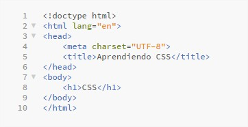
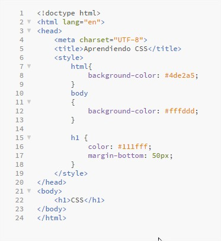
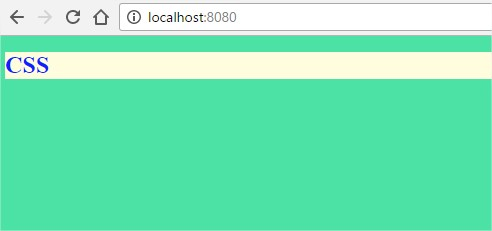
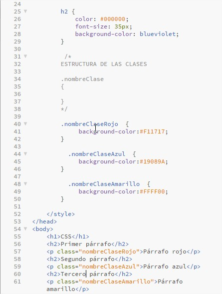
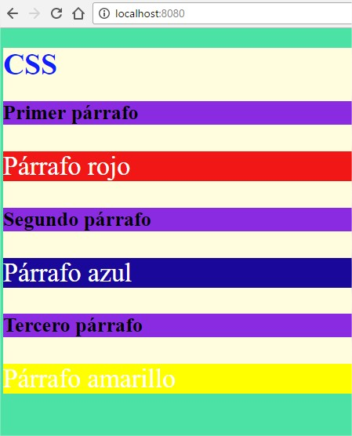
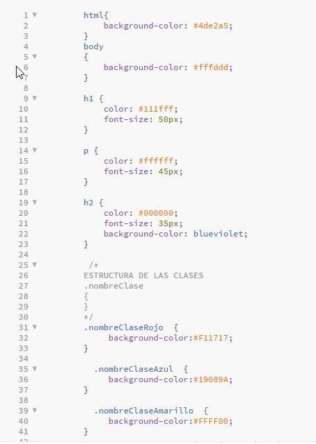
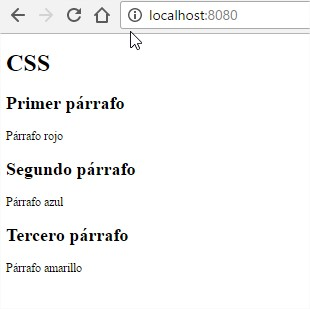
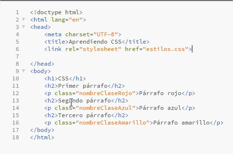
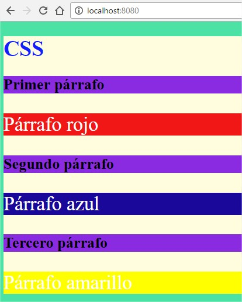

# CSS

### Materia: `Tecnologías Web con JavaScript`
### Tema: `CSS`
### Fecha: `2016-11-02`
### Estudiante: Belén Aracely Quispi Sotamba
### Profesor: Tania Calle - Adrian Eguez
### Número de informe: 2

## Índice de contenidos

* <a href="#tema">Tema</a>
* <a href="#objetivos">Objetivos</a>
* <a href="#marcoTeorico">Marco Teórico</a>
    - <a href="#css">CSS</a>
        - <a href="#sintexisCss">Sintaxis CSS</a>
        - <a href="#formasInsertarCss">Formas de Insertar CSS</a>
            - <a href="#hojaEstilosExterna"> Hojas de Estilos Externa</a>
            - <a href="#hojaEstiloInterna">Hojas de Estilos Interna</a>
            - <a href="#estiloLinea">Estilos en Linea</a>
    - <a href="#bootstrap">Bootstrap</a>
* <a href="#desarrollo">Desarrollo de la Práctica</a>
* <a href="#conrec">Conclusiones y Recomendaciones</a>

## Tema
`CSS`
 
<a href="#cabecera">Ir a la cabecera</a>
 

## Objetivos
* Desarrollar el conocimiento WEB
* Implementar recursos CSS obtenidos del framework Bootstrap.
* Aprender el uso de recursos CSS en la creación de páginas HTML.

 
<a href="#cabecera">Ir a la cabecera</a>
 

## Marco Teórico

### CSS
* CSS significa C ascading S tyle S heets.
* CSS es un lenguaje que describe el estilo de un documento HTML.
* CSS describe cómo los elementos HTML se van a mostrar en la pantalla, papel, o en otros medios. 
* CSS describe cómo se deben mostrar los elementos HTML.
* CSS ahorra mucho trabajo, debido a que puede controlar el diseño de varias páginas web a la vez.
* CSS define incluso la disposicion y las variaciones en la imagen para los diferentes dispositvos y tamaños de pantalla.
* CSS  fue creado por W3C para eliminar el estilo de formato de la página HTML.
(Fuente: [W3School](http://www.w3schools.com/css/css_intro.asp))
 
<a href="#cabecera">Ir a la cabecera</a>
 

#### Sintaxis de CSS
Un conjunto de reglas CSS consta de un selector y un bloque de declaración.

 `h1 {color: blue; font-size:12px;}`

`h1`es el selector, es decir a que elemento HTML se le va dar ese estilo.
`{color: blue; font-size:12px;}` es el bloque de declaración, el cuál consta de una o varias declaraciones. 
Cada declaración es una propiedad CSS y un valor, los cuales son separados por dos puntos.
Cada declaración debe terminar con punto y coma.
(Fuente: [W3School](http://www.w3schools.com/css/css_syntax.asp))
 
<a href="#cabecera">Ir a la cabecera</a>
 

#### Formas de insertar CSS
Hay tres maneras de insertar una hoja de estilo:
* Hoja de estilos externa
* Hoja de estilo interna
* Estilo en línea
(Fuente: [W3School](http://www.w3schools.com/css/css_howto.asp))
 
<a href="#cabecera">Ir a la cabecera</a>
 

#### Hoja de Estilos Externa
* Hoja de estilos externa, puede cambiar el aspecto de un sitio web completo cambiando un archivo. 
* Cada página debe incluir una referencia al archivo de hoja de estilos externa dentro del elemento `<link>`. El elemento `<link>` va dentro de la sección `<head>`.
* Una hoja de estilo externa puede estar escrito en cualquier editor de texto. El archivo no debe contener ninguna etiqueta HTML. 
* El archivo de hoja de estilo debe ser guardado con una extensión .css

##### Ejemplo
`<head>
<link rel="stylesheet" type="text/css" href="mystyle.css">
</head>`
(Fuente: [W3School](http://www.w3schools.com/css/css_howto.asp))
 
<a href="#cabecera">Ir a la cabecera</a>
 

#### Hoja de Estilos Interna
* Una hoja de estilo interna puede ser usado si una sola página tiene un estilo único.

* Los estilos internos se definen dentro del elemento `
</head>`
(Fuente: [W3School](http://www.w3schools.com/css/css_howto.asp))
 
<a href="#cabecera">Ir a la cabecera</a>
 

#### Estilo en línea
* Un estilo en línea se puede utilizar para aplicar un estilo único para un solo elemento.

* Para utilizar los estilos en línea, añadir el atributo de estilo al elemento relevante. El atributo de estilo puede contener cualquier propiedad CSS.

* El siguiente ejemplo muestra cómo cambiar el color y el margen izquierdo de un elemento `<h1>`

##### Ejemplo
 `<h1 style="color:blue;margin-left:30px;">This is a heading.</h1> `
 
##### Nota: 
Cuando se tiene varios estilos para un mismo elemento, estos se aplican en cascada, es decir, se aplicará el primero que se encuentre, luego el segundo hasta el último estilo que fue implementado.
(Fuente: [W3School](http://www.w3schools.com/css/css_howto.asp))
 
<a href="#cabecera">Ir a la cabecera</a>
 

### BOOTSTRAP
* Bootstrap es el framework HTML, CSS y JS más popular para desarrollar proyectos móbiles responsivos en la web.
* Gracias a Bootstrap es posible escalar sitios web y aplicaciones de: teléfonos a tabletas y a computadores de escritorio es más fácil y eficiente.
(Fuente: [Bootstrap](http://getbootstrap.com))
 
<a href="#cabecera">Ir a la cabecera</a>
 

## Desarrollo de la Práctica
En esta práctica se creará un archivo HTML, el cual va a ser modificado. En este caso el archivo se llama *index.html*.

  1. En el archivo *index.html* se escribe un documento html básico. 
  
 

  2. Al archivo *index.html* se usará la inserción Interna CSS, para ello se crea un tag `style` dentro `head`. Como se puede ver en la siguiente imagen.
  
 

* Los estilos que se implementaron se visualiza de la siguiente manera en la página web.
 
 

  3. También se puede implementar clases dentro del tag `<style>`. Las clases también permiten dar un formato a los elementos de HTML, en los cuales se use las clases. La clases se crean de la sigiuente manera.
  
 

* La página web se encuentra como se la puede ver en la siguiente imagen.
 
 

* Se puede observar que la página HTML tiene un fondo verde.
* El cuerpo de la página es beige.
* El `h1` tiene que el color de letra azul.
* Todos `h2` encambio tinen color de letra negro y un fondo violeta.
* Por otro lado los párrafos tienen un colo diferente cada uno. puesto que en cada tag `
`, se llama a una clase diferente. Cada clase posee un color diferente como: rojo, azul y amarillo. Las letras de los párrafos tiene un color blanco en las letras.

 
  4. Una buena técnica es mantener los estilos de una página HTML en archivos fuera del archivo HTML. Para esto se va a crear un archivo llamado *estilos.css*, el cuál nos permite ser utilizado en otras páginas HTML. Entonces el nuevo archivo tendrá la siguiente información. 
  
 

  
  * Como los estilos se movieron del archivo *index.html* al archivo *estilos.css*, la página HTML se vería de la siguiente forma.
  
 

  
  5. Para que el archivo *estilos.css* cambie el formato del archivo *index.html*. Este debe ser referenciado en el archivo *index.html*. Para lo cual se usa el tag `<link>`, en cual va el nombre del archivo CSS. Entonces el archivo *index.html* quedaría de la siguiente manera.
  
 

  * Mientras que en la página HTML se tendría así.
  
 

  
  6. 
  
  

 
<a href="#cabecera">Ir a la cabecera</a>
 