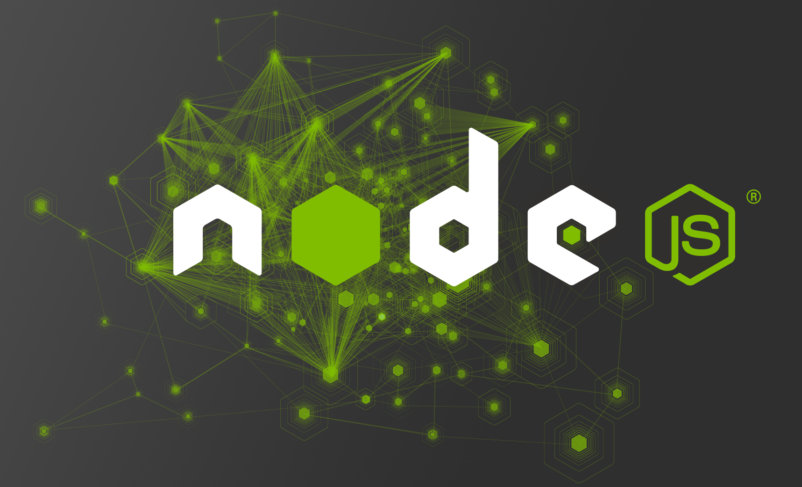

# NPM

### Materia: `Tecnologías Web con JavaScript`
### Tema: `NPM`
### Fecha: `2016-12-08`
### Estudiante: Belén Aracely Quispi Sotamba
### Profesor: Tania Calle - Adrian Eguez
### Número de informe: 4

<a name="Cabecera"></a>
## Índice de contenidos

* <a href="#tema">Tema</a>
* <a href="#objetivos">Objetivos</a>
* <a href="#marcoTeorico">Marco Teórico</a>
    - <a href="#node">Node.js</a>
    - <a href="#npm">NPM</a>
* <a href="#desarrollo">Desarrollo de la Práctica</a>
* <a href="#conrec">Conclusiones y Recomendaciones</a>

<a name="tema"></a>
## Tema
`NPM`
<br>
<a href="#Cabecera">Ir a la cabecera</a>
<br>

<a name="objetivos"></a>
## Objetivos
* Entender el funcionamiento de Node.js en aplicaciones desarrolladas con JavaScript
* Desarrollar el conocimiento Web.
* Aprender agestionar paquetes con npm.
* Crear paquetes que pueden ser utilizados en un futuro o por otras personas. 

<br>
<a href="#Cabecera">Ir a la cabecera</a>
<br>


<a name="marcoTeorico"></a>
## Marco Teórico
<a name="node"></a>
### Node.js
* Node.js es un entorno de ejecución para JavaScript construido con el motor de JavaScript V8 de Chrome. 
* Node.js usa un modelo de operaciones E/S sin bloqueo y orientado a eventos, que lo hace liviano y eficiente. 
* El ecosistema de paquetes de Node.js, npm, es el ecosistema mas grande de librerías de código abierto en el mundo.
<p align="center"> </p>
<br>
(Fuente: [Node.js](https://nodejs.org/es/))
<br>
<a href="#Cabecera">Ir a la cabecera</a>
<br>

<a name="npm"></a>
### NPM
* Npm es el gestor de paquetes para JavaScript. 
* Npm es un montón de cosas.
* Npm es el gestor de paquetes de Node.js. Fue creado en 2009 como un proyecto de código abierto para ayudar a los desarrolladores de JavaScript compartir fácilmente módulos de código empaquetados.
* El npm Registry es una colección pública de paquetes de código abierto para Node.js, aplicaciones web frontales, aplicaciones para móviles, robots, enrutadores y muchas otras necesidades de la comunidad de JavaScript.
* Npm es el cliente de línea de comandos que permite a los desarrolladores instalar y publicar paquetes.
<p align="center"> </p>
<br>
(Fuente: [NPM](https://www.npmjs.com/about))
<br>
<a href="#Cabecera">Ir a la cabecera</a>
<br>

<a name="desarrollo"></a>
## Desarrollo de la Práctica

1) Para poder usar `npm`, debemos instala Node.js. Por lo cual se accede a la página de Node.js para descargar el instalador. El enlace del cual se va a descargar es el siguiente: [Node.js](https://nodejs.org/es/).
<p align="center"> </p>
<br>

2) Ejecutar el instalador que se ha descargado. 

<p align="center"> </p>
<br>

3) Después se abre el setup de Node.js, y solo queda en dar clic en instalar y luego en siguiente hasta que la instalación termine. 
<p align="center"> </p>
<br>

4) Una vez que se ha instalado se puede verificar, para lo cual se abre la consola, en este caso cmd y se ejecuta el comando `node`. Si aparece el símbolo `>` es porque se encuentra instalado ya. Tal como se puede visualizar en la siguiente imagen.
<p align="center"> </p>
<br>

5) Ejemplo de código JS que se puede ejecutar en consola. 
<p align="center"> </p>
<br>

6) Para salir de la consola de node se lo hace con la siguiente combinación de teclas `ctrl + c`, esto se lo realiza dos veces seguidas.


7) Ahora se procede a crear una carpeta en la cual se va a crear los archivos para crear el paquete, en este caso la carpeta se llama *Nodejs*. En esta carpeta se crea un archivo llamado *app.js*. En este archivo se ingresará el código JS a ser usado en el paquete. 

```javascript
var numero1 = 8;
var numero2 = 4;
var resultado = numero1 + numero2;
console.log(resultado);

```

8) Para comprobar que el archivo *app.js* se encuentra correcto, se escribe el comando *node* junto con el nombre del archivo, en este caso es *app.js*.
<p align="center"> </p>
<br>

* En la imagen anterior se puede observar el resultado de la suma de los dos números que se encuentran en el archivo *app.js*.

9) Luego se procede a crear un paquete json, para lo cual se ejecuta el comando `npm init`.
<p align="center"> </p>
<br>

10) Se llena la información que pide para la creación del paquete, al final se acepta con *yes*. En el campo *main* se puede observar que se llena con el nombre *app.js*, que es el archivo que contiene el código JS.
<p align="center"> </p>
<br>

11) Comprobar que se creado el paquete JSON en la carpeta de nuestro computador. Al abrirlo se muestra la información que se lleno anteriormente.
<p align="center"> </p>
<br>


12) Para subir el paquete creado a internet se debe tener una cuenta en *npm*. Para crear la cuenta se dirigen al link : [crear cuenta en npm](https://www.npmjs.com/signup) y se llena los campos pertinentes.

13) Una vez creada la cuenta, en  inicia sesión en consola de comandos. Esto se lo hace con el comando `npm login` y después se inserta el username, password y email. 
<p align="center"> </p>
<br>

14) Como ya esta iniciado sesión se puede publicar el paquete, para ello se usa el comando `npm publish `.
<p align="center"> </p>
<br>

15) Para comprobar que el paquete ha sido publicado, se lo puede hacer verificando en la página web. En este caso se puede que el paquete se ha publicado sin ningún problema.
<p align="center"> </p>
<br>

16) También se puede descargar un paquete e instalarlo. Se puede hacer de manera local usando el comando `npm i nombrePaquete` o de manera global usando en comando `npm i -g nombrePaquete`. En este caso se hará de manera global 
<p align="center"> </p>
<br>

17) Para realizar de manera local es necesario estar en la carpeta donde se desea instalar el paquete, en este caso la carpeta se llama *Nodejs2*. Se ejecuta el comando `npm i nombrePaquete`
<p align="center"> </p>
<br>

18) Para comprobar que el paquete se ha descargado localmente se dirige a la carpeta en la cual se seleccionó para la descargar. 
<p align="center"> </p>
<br>

19) Para desinstalar un paquete se usa el comando `npm uninstall nombrePaquete`.

20) Para importar un paquete, es necesario cambiar ciertas cosas en el código del paquete descargado. Después de las modificaciones en segundo archivo *app.js*, se quedo con el siguiente código. 
```javascript
module.exports = {
    imprimirSuma : imprimirSuma,

}

function imprimirSuma() {
    var numero1 = 8;
    var numero2 = 4;

    var resultado = numero1 + numero2;

    console.log(resultado);

}
```

* En esta implementación se ha creado un función llamada *imprimirSuma* que va a mostrar la resultado de la suma de 8 y 4.
* El comando *module.exports* permite que la funcion se exporte.

21) Para ver que se puede realizar la importacion de la funcion *imprimirSuma* se va a crear un archino denominado *app.js* junto a la carpeta *node_modules*.
<p align="center"> </p>
<br>

22) En el archivo que se ha creado recienmente, se procede a ingresar el siguiente código.

```javascript
var calculadora = require("calcubquispi");

console.log(calculadora.imprimirSuma());

```
* El comando `require` permite la llamada al paquete que se ha creado y este le asigna a la variable calculadora.
* Como el paquete contiene la función *imprimirSuma* esta puede ser llamada en este archivo. 

23) Si se ejecuta el archivo que se edito en el paso anterior, se podría comprobar si se importo o no el paquete.

<p align="center"> </p>
<br>

<br>
<a href="#Cabecera">Ir a la cabecera</a>
<br>

<a name="conrec"></a>
## Conclusiones y Recomendaciones
* Node.js y npm son muy útiles al momento de programar aplicaciones con código JS.
* Npm permite la creacion de paquetes, así como poderlos publicar, exportar, instalar y desinstalar.
* Se aprendió a crear paquetes que pueden ser reutilizados en un futuro o por otras personas.
* Como buena práctica de programación se sugiere que los código sean claros y posean comentarios, sobre todo en códigos muy extensos.

<br>
<a href="#Cabecera">Ir a la cabecera</a>
<br>
___ 

Autor: <a href="https://github.com/belenquispi">Belén Quispi</a>
<br>
<a href="#Cabecera">Ir a la cabecera</a>
<br>
